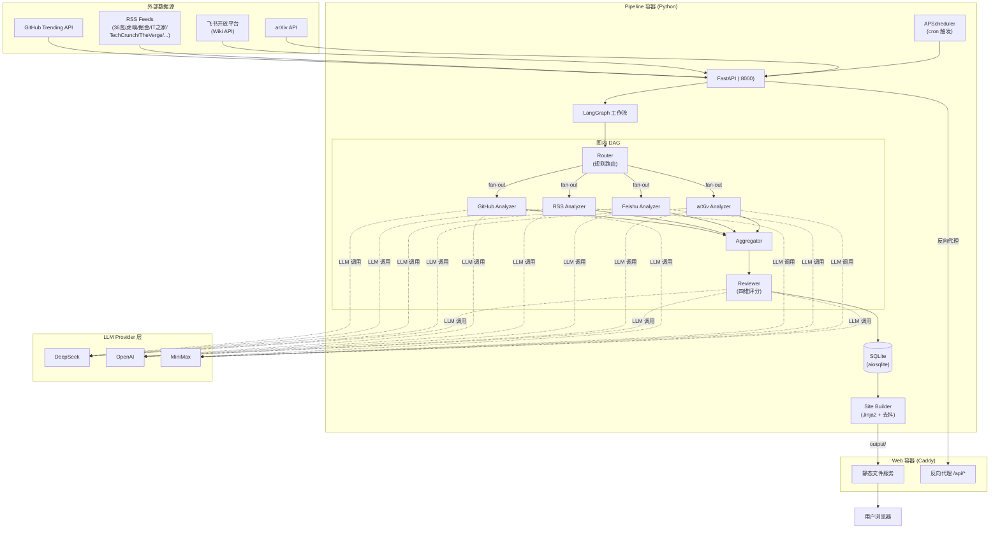
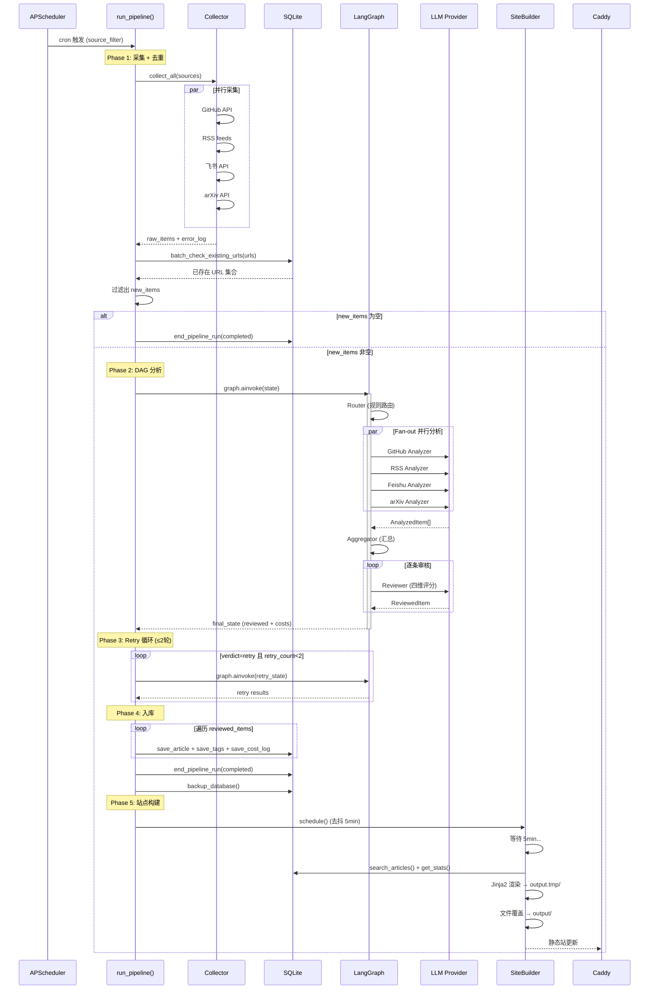
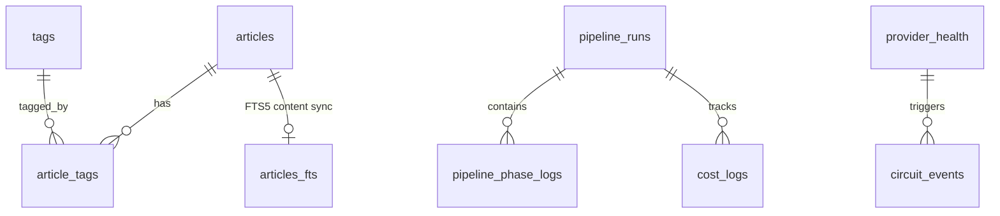
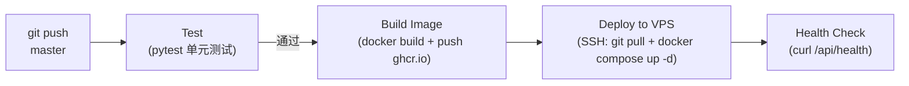

# AI Knowledge Base

> 个人 AI 知识库系统 — 自动化采集、分析与展示 AI/LLM/Agent 领域前沿资讯

[](https://github.com/kangapp/ai-knowledge-base/actions/workflows/deploy.yml)


---

## 目录

1. [整体架构](#1-整体架构)
2. [数据流向](#2-数据流向)
3. [数据模型](#3-数据模型)
4. [技术栈](#4-技术栈)
5. [快速上手与本地开发](#5-快速上手与本地开发)
6. [项目目录结构](#6-项目目录结构)
7. [配置与环境变量](#7-配置与环境变量)
8. [部署与运维流程](#8-部署与运维流程)
9. [问题排查与可观测性](#9-问题排查与可观测性)
10. [工程治理与演进局限](#10-工程治理与演进局限)

---

## 1. 整体架构

### 1.1 架构拓扑

系统采用 **单体进程 + DAG 流水线** 架构，以 FastAPI 作为控制面，LangGraph 编排数据加工流水线，最终产出纯静态网站。



### 1.2 组件职责

| 组件 | 层级 | 职责 |
|------|------|------|
| **FastAPI** | 控制面 | HTTP 接口、健康检查、手动触发采集/构建 |
| **APScheduler** | 调度层 | 按 cron 表达式定时触发各数据源采集 (`skip_if_running` 防重叠) |
| **LangGraph** | 编排层 | DAG 工作流：Router → Fan-out(4×Analyzer) → Aggregator → Reviewer |
| **Collector** | 采集层 | 并行调用 GitHub/RSS/飞书/arXiv API，含 DB 批量查重 |
| **Analyzer (×4)** | 分析层 | 各源独立 SubAgent，通过 LLM 分析产出结构化摘要与标签 |
| **Reviewer** | 审核层 | 四维评分（AI相关度/内容深度/信息密度/时效性）+ 判决 (approved/retry/discarded) |
| **LLMRegistry** | 基础设施 | 多 Provider 管理、独立熔断、fallback 链、预算控制 |
| **SQLite** | 存储层 | FTS5 全文索引、文章/标签/花费/流水线状态持久化 |
| **SiteBuilder** | 产出层 | Jinja2 预渲染首页 + data.json + stats.json，去抖触发 (5min) |
| **Caddy** | 服务层 | 静态文件服务 + `/api/*` 反向代理 |

### 1.3 关键设计决策

- **Collector 和 DB 操作在图外执行** — LangGraph 图内不持有 DB 连接，采集和入库在 `main.py` 的 `run_pipeline()` 中直接编排
- **Router 纯规则匹配** — 100% 按 `RawItem.source` 字段分流，不走 LLM，零延迟
- **Fan-out 并行分析** — 4 个 Analyzer 各自独立 Prompt 和 Model，互不阻塞
- **Retry 循环在图外** — `verdict=retry` 的文章回到图外重新构建 state 再跑图，最多 2 轮
- **去抖构建** — Pipeline 完成后 5 分钟内无新触发才执行站点构建，避免高频采集时的无效渲染

---

## 2. 数据流向

### 2.1 核心业务链路

系统的主链路是从数据采集到静态网站发布的完整管道，分为 **6 个阶段**：

```
调度触发 → 并行采集 + DB去重 → DAG分析 + 审核 → Retry循环(≤2轮) → 入库 → 站点构建
```

**控制流（Control Flow）**：由 `run_pipeline()` 函数集中编排，负责阶段间顺序控制、条件分支（无新数据跳过分析）、Retry 循环边界。

**数据流（Data Flow）**：数据依次经历 3 个 Pydantic 模型转换：

```
RawItem (采集) → AnalyzedItem (LLM分析) → ReviewedItem (四维评分) → articles 表 (入库)
```

### 2.2 核心流程时序图



### 2.3 错误隔离

- **单源采集失败** → 不中断其它源，记录 error_log
- **单条 LLM 分析失败** → 跳过该条，继续处理下一条
- **Reviewer LLM 调用失败** → 内部重试 2 次，仍失败则 verdict=discarded
- **所有源全挂** → 标记 pipeline failed，下次 cron 兜底

---

## 3. 数据模型

### 3.1 存储拓扑

| 数据类型 | 存储介质 | 位置 | 说明 |
|----------|----------|------|------|
| 结构化业务数据 | SQLite (FTS5) | `data/kb.db` | 文章、标签、花费、流水线状态 |
| 全文索引 | SQLite FTS5 虚拟表 | `articles_fts` | 标题/摘要/描述全文检索 |
| 静态站点产物 | 文件系统 | `output/` | HTML + JSON + CSS/JS |
| 数据库备份 | SQLite .backup() | `data/backup/` | 每日热备份，保留 7 天 |
| 配置文件 | YAML 文件 | `config/` | LLM Provider、数据源、SubAgent 绑定 |
| Prompt 模板 | Markdown 文件 | `prompts/` | 各 Analyzer 和 Reviewer 的系统指令 |
| 运行时状态 | 内存 (dict) | `HealthTracker` / `BudgetTracker` | 熔断状态、预算计数（重启丢失） |

### 3.2 核心表结构

#### articles — 文章主表

| 字段 | 类型 | 约束 | 说明 |
|------|------|------|------|
| `id` | INTEGER | PK AUTOINCREMENT | |
| `title` | TEXT | NOT NULL | 文章标题 |
| `url` | TEXT | NOT NULL UNIQUE | 唯一标识，防重复采集 |
| `description` | TEXT | | 原始摘要（截断至 200 字符对外暴露） |
| `summary` | TEXT | | AI 生成摘要（详情页 API 按需返回） |
| `source` | TEXT | NOT NULL | github / rss / feishu / arxiv |
| `source_detail` | TEXT | | 源内详情（repo 全名、频道名等） |
| `relevance_score` | INTEGER | DEFAULT 0 | 总评分 (0-100) |
| `status` | TEXT | DEFAULT 'pending' | pending / approved / retry / discarded |
| `retry_count` | INTEGER | DEFAULT 0 | retry 重试次数 |
| `collected_at` | TEXT | NOT NULL | ISO 8601 采集时间 |
| `published_at` | TEXT | | 原始发布时间 |
| `extra_data` | TEXT (JSON) | | 四维评分明细 + language + 原始 metadata |
| `analysis_cost` | REAL | DEFAULT 0.0 | 该条目 LLM 分析总花费 ($) |
| `analysis_tokens` | INTEGER | DEFAULT 0 | 该条目分析 token 总量 |
| `created_at` | TEXT | DEFAULT datetime('now') | |
| `updated_at` | TEXT | DEFAULT datetime('now') | |

**索引**：`url` (UNIQUE), `source`, `status`, `collected_at`  
**FTS5**：`articles_fts` 覆盖 (title, summary, description)，含 INSERT/UPDATE/DELETE 触发器自动同步

#### tags — 标签字典

| 字段 | 类型 | 约束 | 说明 |
|------|------|------|------|
| `id` | INTEGER | PK AUTOINCREMENT | |
| `name` | TEXT | UNIQUE NOT NULL | 标签名（Analyzer 自由建议，自动收录） |
| `color` | TEXT | | 预留颜色字段 |

#### article_tags — 文章-标签关联

| 字段 | 类型 | 约束 |
|------|------|------|
| `article_id` | INTEGER | FK → articles(id) ON DELETE CASCADE |
| `tag_id` | INTEGER | FK → tags(id) ON DELETE CASCADE |
| | | PRIMARY KEY (article_id, tag_id) |

#### pipeline_runs — 流水线运行记录

| 字段 | 类型 | 约束 | 说明 |
|------|------|------|------|
| `id` | TEXT | PK | `run_YYYYMMDD_HHMMSS` |
| `started_at` | TEXT | NOT NULL | |
| `ended_at` | TEXT | | |
| `status` | TEXT | DEFAULT 'running' | running / completed / failed |
| `trigger` | TEXT | | cron / manual |
| `summary` | TEXT (JSON) | | 采集数/去重/入库/丢弃/花费/错误 |

#### pipeline_phase_logs — 阶段耗时日志

| 字段 | 类型 | 约束 | 说明 |
|------|------|------|------|
| `id` | INTEGER | PK AUTOINCREMENT | |
| `run_id` | TEXT | FK → pipeline_runs(id) | |
| `phase` | TEXT | NOT NULL | collect / route / analyze / aggregate / review |
| `status` | TEXT | NOT NULL | running / done / failed |
| `started_at` | TEXT | | |
| `ended_at` | TEXT | | |
| `duration_ms` | INTEGER | | 阶段耗时（毫秒） |
| `details` | TEXT | | 附加信息 |

#### cost_logs — LLM 调用花费

| 字段 | 类型 | 说明 |
|------|------|------|
| `id` | INTEGER PK AUTOINCREMENT | |
| `run_id` | TEXT FK → pipeline_runs(id) | |
| `agent` | TEXT | github_analyzer / rss_analyzer / feishu_analyzer / arxiv_analyzer / reviewer |
| `provider` | TEXT | deepseek / openai / minimax |
| `model` | TEXT | 具体模型 ID |
| `tokens_in` | INTEGER | |
| `tokens_out` | INTEGER | |
| `cost` | REAL | 本次调用花费 ($) |
| `created_at` | TEXT DEFAULT datetime('now') | |

#### provider_health / circuit_events — 健康与熔断

`provider_health` 记录 per-provider 的 circuit 状态（closed/open/half_open）、错误计数、冷却等级；`circuit_events` 记录每次熔断状态变更事件，用于事后审计。

### 3.3 ER 关系图



---

## 4. 技术栈

### 4.1 全栈盘点

| 层级 | 技术 | 版本 | 用途 |
|------|------|------|------|
| **语言** | Python | ≥3.12 | 全栈开发语言 |
| **Web 框架** | FastAPI | ≥0.115 | HTTP API + 生命周期管理 |
| **ASGI 服务器** | Uvicorn | ≥0.30 | 生产级 ASGI 运行 |
| **工作流编排** | LangGraph | ≥0.2 | DAG 流水线编排、fan-out 并行 |
| **LLM SDK** | OpenAI (openai) | ≥1.0 | 统一 OpenAI 兼容协议调用 |
| **数据校验** | Pydantic | ≥2.0 | State + Config + API 出入参校验 |
| **配置管理** | pydantic-settings | ≥2.0 | 配置加载 |
| **HTTP 客户端** | httpx | ≥0.27 | 异步采集 + API 调用 |
| **RSS 解析** | feedparser | ≥6.0 | RSS/Atom 解析 |
| **模板引擎** | Jinja2 | ≥3.1 | 静态站点预渲染 |
| **任务调度** | APScheduler | ≥3.10 | cron 定时采集 |
| **数据库** | SQLite (aiosqlite) | ≥0.20 | 业务数据 + FTS5 全文索引 |
| **YAML 解析** | PyYAML | ≥6.0 | 配置文件读取 |
| **可观测性** | Langfuse | ≥2.0 | LLM 调用追踪（可选） |
| **依赖管理** | uv | latest | 依赖锁定与同步 |
| **构建系统** | Hatchling | — | Python 包构建 |
| **Web 服务器** | Caddy | alpine | 静态文件 + 自动 HTTPS + 反向代理 |
| **容器化** | Docker + Compose | — | 2 容器部署 (pipeline + web) |
| **CI/CD** | GitHub Actions | — | 分层测试 → 镜像构建 → VPS 部署 |
| **前端图表** | Chart.js | v4 (CDN) | 仪表盘折线图/饼图 |
| **前端样式** | 原生 CSS | — | 无框架，~600 行自定义样式 |

### 4.2 选型理由

| 决策 | 选型 | 理由 |
|------|------|------|
| 数据库 | SQLite (非 PostgreSQL) | 单用户、年数据 ~20MB、零运维、Docker volume 即备份 |
| 工作流 | LangGraph (非 Airflow/Temporal) | 短 pipeline 无需 checkpoint；fan-out 原生支持；Python 原生集成 |
| LLM 协议 | OpenAI 兼容 (非 Anthropic 原生) | 覆盖 DeepSeek/OpenAI/MiniMax，统一 SDK |
| ORM | 无 (裸 aiosqlite) | 9 张表、查询简单，ORM 增加复杂度无收益 |
| 静态站 | Jinja2 预渲染 + JS 交互 | 首屏秒开、SEO 友好、Caddy 直接 serve |
| 前端框架 | 无 (原生 JS) | 交互简单（筛选/搜索/图表），引入框架是过度工程 |
| 部署 | Docker Compose (非 K8s) | 单机 1C2G VPS，Compose 足够 |
| CI/CD | GitHub Actions | 免费、与 GitHub 深度集成、社区 actions 丰富 |

---

## 5. 快速上手与本地开发

### 5.1 前期依赖 (Prerequisites)

| 工具 | 版本要求 | 说明 |
|------|----------|------|
| Python | ≥3.12 | 运行时语言 |
| uv | latest | 依赖管理（`brew install uv` 或 `pip install uv`） |
| Docker + Docker Compose | latest | 容器化部署（可选，本地开发可不用） |
| Git | latest | 版本管理 |

### 5.2 一步步启动指南

```bash
# 1. 克隆仓库
git clone https://github.com/kangapp/ai-knowledge-base.git
cd ai-knowledge-base

# 2. 安装依赖
uv sync
uv sync --dev  # 含 pytest 等开发依赖

# 3. 配置环境变量
cp .env.example .env
# 编辑 .env，填入真实的 LLM Provider API Keys 和 GitHub Token
# 至少需要配置 DEEPSEEK_API_KEY 才能跑通完整流程

# 4. 初始化数据库（首次启动自动运行 migration）
mkdir -p data output

# 5. 启动开发服务器
uv run uvicorn src.main:app --reload --host 0.0.0.0 --port 8000

# 6. 验证健康检查
curl http://localhost:8000/api/health
# → {"status": "ok"}

# 7. 手动触发一次采集
curl -X POST http://localhost:8000/api/pipeline/run

# 8. 手动触发站点构建
curl -X POST http://localhost:8000/api/pipeline/build

# 9. 访问页面
# 首页:       http://localhost:8000/
# 仪表盘:     http://localhost:8000/dashboard.html
# DAG 状态:   http://localhost:8000/dag.html
# 配置查看:   http://localhost:8000/config.html
# 文章详情:   http://localhost:8000/article.html?id=1
# API 文档:   http://localhost:8000/docs
```

### 5.3 测试指令

```bash
# 单元测试 (CI 运行，LLM mock，<30s)
uv run pytest -m "not integration and not e2e"

# 集成测试 (需要真实 API Key，手动触发)
uv run pytest -m integration

# 端到端测试 (全 mock 完整流程)
uv run pytest -m e2e

# 全量测试
uv run pytest

# 运行特定测试文件
uv run pytest tests/test_collector.py -v

# Prompt 回归测试 (改 Prompt 后必跑)
uv run pytest tests/test_prompt_regression.py -v

# 查看覆盖率 (需要安装 coverage)
uv run pytest --cov=src --cov-report=term-missing
```

**测试分层策略**：

| 层级 | Marker | 运行环境 | 耗时 | 说明 |
|------|--------|----------|------|------|
| 单元测试 | (默认) | CI | <30s | Mock LLM + HTTP fixture |
| 集成测试 | `integration` | 本地手动 | ~2min | 真实 API + 真实 LLM |
| E2E 测试 | `e2e` | 本地手动 | ~1min | 全 mock 完整流程 |

---

## 6. 项目目录结构

```
ai-knowledge-base/
├── pyproject.toml                # 项目元数据 + 依赖声明 (uv)
├── uv.lock                       # 锁版本 (不可手动编辑)
├── Dockerfile                    # Pipeline 容器镜像构建
├── docker-compose.yml            # 2 容器编排 (pipeline + web)
├── Caddyfile                     # Caddy 配置 (静态文件 + 反向代理)
├── .env.example                  # 密钥清单模板 (入 Git)
├── .gitignore                    # Git 忽略规则
│
├── .github/workflows/
│   └── deploy.yml                # CI/CD: 测试 → 构建镜像 → VPS 部署
│
├── config/                       # 配置文件 (YAML，Docker volume mount)
│   ├── llm.yaml                  #   LLM Provider 注册 (base_url, models, 价格)
│   ├── sources.yaml              #   数据源定义 (12 个源，各自 cron + filter)
│   └── agents.yaml               #   SubAgent 模型绑定 (primary/fallback) + 预算
│
├── prompts/                      # LLM Prompt 模板 (Git 版本管理)
│   ├── github_analyzer.md        #   GitHub Analyzer 系统指令
│   ├── rss_analyzer.md           #   RSS Analyzer 系统指令
│   ├── feishu_analyzer.md        #   飞书 Analyzer 系统指令
│   ├── arxiv_analyzer.md         #   arXiv Analyzer 系统指令
│   └── reviewer.md               #   Reviewer 四维评分锚点
│
├── src/                          # 源代码
│   ├── main.py                   #   FastAPI 入口 + APScheduler + 生命周期管理
│   │
│   ├── core/                     # 基础设施层
│   │   ├── config.py             #   配置加载 (YAML → Pydantic，支持 ${ENV} 插值)
│   │   ├── database.py           #   SQLite 连接 + 版本化 migration 自动执行
│   │   ├── llm_client.py         #   LLMRegistry: 多 Provider 管理 + 熔断 + fallback
│   │   ├── budget.py             #   预算追踪 (软/硬熔断)
│   │   └── health.py             #   Provider 健康状态机 (closed/open/half_open)
│   │
│   ├── graph/                    # LangGraph 工作流层
│   │   ├── pipeline.py           #   DAG 编排 + 图构建
│   │   ├── state.py              #   PipelineState + 3 个核心 Pydantic 模型
│   │   ├── collector.py          #   并行采集 (GitHub/RSS/飞书/arXiv)
│   │   ├── router.py             #   规则路由 (按 source 字段分流)
│   │   ├── aggregator.py         #   汇总节点 (operator.add reducer)
│   │   ├── reviewer.py           #   四维评分审核 (temp=0)
│   │   └── analyzers/            #   4 个 Analyzer 节点 (薄层 ~8行)
│   │       ├── base.py           #     通用 analyze_items() (LLM 调用 + 校验 + 重试)
│   │       ├── github.py         #     GitHub Analyzer
│   │       ├── rss.py            #     RSS Analyzer
│   │       ├── feishu.py         #     飞书 Analyzer
│   │       └── arxiv.py          #     arXiv Analyzer
│   │
│   ├── db/                       # 数据访问层
│   │   ├── operations.py         #   文章 CRUD + 搜索 + 统计 + 备份
│   │   └── migrations/           #   版本化 SQL 文件 (按编号递增)
│   │       ├── 001_init.sql      #     初始化全部 9 张表 + FTS5 + 触发器
│   │       └── 002_phase_logs.sql#     新增 pipeline_phase_logs 表
│   │
│   ├── api/                      # FastAPI 路由
│   │   ├── routes.py             #   /api/* 核心端点 + 统一信封 + 异常处理
│   │   ├── config.py             #   /api/config/* 配置查看
│   │   └── stats.py              #   /api/stats/enhanced 增强统计
│   │
│   └── site/                     # 静态站点生成
│       ├── builder.py            #   SiteBuilder + DebouncedBuilder (5min 去抖)
│       ├── templates/            #   Jinja2 模板
│       │   ├── base.html         #     基础布局 (nav + CDN + CSS)
│       │   ├── index.html        #     首页 (服务端预渲染 30 天 + JS 后续过滤)
│       │   ├── article.html      #     详情页 (JS fetch /api/articles/{id})
│       │   ├── dashboard.html    #     仪表盘 (Chart.js 图表)
│       │   ├── config.html       #     配置查看页 (JS 加载 /api/config/*)
│       │   └── dag.html          #     DAG 状态页 (JS 加载 /api/pipeline/dag)
│       └── static/               #   静态资源
│           ├── css/style.css     #     全部样式 (~600 行)
│           └── js/app.js         #     前端交互 (筛选/搜索/图表初始化)
│
├── data/                         # 运行时数据 (volume mount，不入 Git)
│   ├── kb.db                     #   SQLite 数据库
│   └── backup/                   #   每日 .backup() 热备份 (保留 7 天)
│
├── output/                       # 静态站点产物 (volume mount，Caddy serve)
│   ├── index.html                #   首页 (Jinja2 预渲染)
│   ├── article.html              #   详情页外壳
│   ├── dashboard.html            #   仪表盘 (内联 stats)
│   ├── config.html               #   配置查看页
│   ├── dag.html                  #   DAG 状态页
│   ├── data.json                 #   文章列表 (不含 summary)
│   ├── stats.json                #   统计数据 (<10KB)
│   └── static/                   #   复制的静态资源
│
├── docs/                         # 设计文档
│   ├── architecture.md           #   架构设计 (DAG 流程 + 评分锚点 + LLM 管理)
│   ├── structure.md              #   代码组织规范 + 目录结构 + 核心约定
│   ├── data-model.md             #   数据模型 (9 张表 Schema + 配置结构)
│   ├── operations.md             #   运维文档 (部署 + CI/CD + 备份 + 应急)
│   └── bug-progress.md           #   Bug 踩坑记录 + 修复方案
│
├── tests/                        # 测试
│   ├── conftest.py               #   pytest fixtures (配置 + mock)
│   ├── fixtures/                 #   种子数据 + mock LLM 响应
│   ├── test_collector.py         #   采集器测试
│   ├── test_analyzer.py          #   分析器测试
│   ├── test_reviewer.py          #   审核器测试
│   ├── test_router.py            #   路由测试
│   ├── test_pipeline.py          #   流水线集成测试
│   ├── test_llm_client.py        #   LLM 客户端 + 熔断测试
│   ├── test_budget.py            #   预算控制测试
│   ├── test_config.py            #   配置加载测试
│   ├── test_database.py          #   数据库操作测试
│   ├── test_health.py            #   健康检查 + 熔断状态机测试
│   └── test_prompt_regression.py #   Prompt 回归测试
│
└── output.tmp.*/                 # 构建临时目录 (可安全删除)
```

---

## 7. 配置与环境变量

### 7.1 配置矩阵

系统采用 **三层配置解耦**：YAML 定义结构（入 Git）→ `.env` 注入密钥（不入 Git）。

#### YAML 配置文件

| 文件 | 用途 | 关键字段 |
|------|------|----------|
| `config/llm.yaml` | LLM Provider 注册 | `providers.{name}.base_url`, `api_key`, `supports_json_mode`, `models[]` |
| `config/sources.yaml` | 数据源定义 | `sources[].{id, type, enabled, cron, max_items, config}` |
| `config/agents.yaml` | SubAgent 绑定 + 预算 | `agents.{name}.{model.primary, model.fallback[], params, prompt, budget_weight}`, `budget.{monthly, soft_limit, hard_limit}` |

#### 环境变量

| 变量名 | 用途 | 是否必填 | 默认值 | 说明 |
|--------|------|----------|--------|------|
| `DEEPSEEK_API_KEY` | DeepSeek API 密钥 | **必填** | — | 主 LLM，极低成本 |
| `OPENAI_API_KEY` | OpenAI API 密钥 | 可选 | — | Fallback 链中的备选 Provider |
| `MINIMAX_API_KEY` | MiniMax API 密钥 | 可选 | — | 飞书 Analyzer 的 primary Provider |
| `GITHUB_TOKEN` | GitHub Personal Access Token | 建议填写 | — | 未配置时 API 限速 60 req/hr，配置后 5000 req/hr |
| `FEISHU_APP_ID` | 飞书应用 ID | 可选 | — | 飞书知识库采集需要 |
| `FEISHU_APP_SECRET` | 飞书应用密钥 | 可选 | — | 与 APP_ID 配对使用 |
| `KB_DOMAIN` | 站点域名 | 可选 | `kb.your-domain.com` | Caddy 自动 HTTPS 使用 |
| `LANGFUSE_PUBLIC_KEY` | Langfuse 公钥 | 可选 | — | LLM 可观测性追踪 |
| `LANGFUSE_SECRET_KEY` | Langfuse 密钥 | 可选 | — | 与 PUBLIC_KEY 配对 |
| `LANGFUSE_HOST` | Langfuse 服务地址 | 可选 | `https://cloud.langfuse.com` | |

**YAML 文件中的环境变量引用**：使用 `${VARIABLE_NAME}` 语法，启动时 `config.py` 自动将占位符替换为环境变量实际值。若引用的环境变量未设置，启动将直接失败（fail fast）。

```yaml
# config/llm.yaml 示例
providers:
  deepseek:
    api_key: ${DEEPSEEK_API_KEY}   # ← 启动时自动替换
```

### 7.2 密钥管理

**本地开发**：
- `.env` 文件存放于项目根目录，已加入 `.gitignore`
- `.env.example` 作为密钥清单模板入 Git，团队成员据此创建自己的 `.env`

**生产环境 (VPS)**：
- `.env` 文件存储在 VPS 的 `/opt/ai-knowledge-base/.env`
- Docker Compose 通过 `env_file: .env` 注入容器
- 密钥轮换步骤：`vim .env` → `docker compose restart pipeline`
- **安全建议**（行业最佳实践）：
  - 限制 `.env` 文件权限：`chmod 600 .env`
  - 考虑使用 Docker secrets 或 HashiCorp Vault 管理生产密钥
  - 定期轮换 API Key，尤其是 GitHub Token 和 LLM API Key
  - 为不同环境使用不同的 API Key（如 OpenAI 可以创建多个 Key 区分 dev/prod）

---

## 8. 部署与运维流程

### 8.1 CI/CD 管道



**管道详情**（`.github/workflows/deploy.yml`）：

| Job | 触发条件 | 运行环境 | 关键步骤 |
|-----|----------|----------|----------|
| `test` | push master | ubuntu-latest | `uv sync --frozen --dev` → `pytest -m "not integration and not e2e"` |
| `build-image` | test 通过 | ubuntu-latest | `docker/build-push-action@v6` → push 到 `ghcr.io` |
| `deploy` | build-image 通过 + master 分支 | ubuntu-latest | SSH 到 VPS → `git reset --hard origin/master` → `docker compose up -d` |

**关键设计**：
- 镜像在 CI 构建（GitHub Actions 有缓存加速），VPS 只做 `docker pull` + `docker compose up -d`，避免 1C2G VPS 构建超时
- `deploy` job 使用 `if: github.ref == 'refs/heads/master'` 确保只在主分支触发
- SSH 使用 `appleboy/ssh-action@v1`，超时 10 分钟

### 8.2 运行环境

**部署形态**：Docker Compose 单机双容器

| 环境 | 用途 | 部署方式 |
|------|------|----------|
| **本地开发** | 代码调试 | `uv run uvicorn src.main:app --reload` (不启动 Caddy) |
| **生产 (Prod)** | VPS 运行 | Docker Compose `pipeline` + `web` 容器 |

**Docker Compose 拓扑**：

```
VPS (1C2G, 端口 8090)
├── pipeline 容器 (ghcr.io/kangapp/ai-knowledge-base:latest)
│   ├── FastAPI :8000
│   ├── APScheduler (cron 定时采集)
│   ├── volumes: ./data, ./output, ./config (ro)
│   └── healthcheck: curl localhost:8000/api/health (30s interval)
│
└── web 容器 (caddy:alpine)
    ├── :80 → 静态文件 (/srv)
    ├── /api/* → pipeline:8000 (反向代理)
    ├── ports: 8090:80 (宿主机)
    ├── volumes: ./output (ro), ./Caddyfile (ro)
    └── depends_on: pipeline
```

### 8.3 VPS 初始化

```bash
# 1. 安装 Docker
curl -fsSL https://get.docker.com | sh
# 2. 克隆仓库
git clone https://github.com/kangapp/ai-knowledge-base.git /opt/ai-knowledge-base
cd /opt/ai-knowledge-base
# 3. 创建 .env 并填入密钥
cp .env.example .env
vim .env
# 4. 启动服务
docker compose up -d
# 5. 验证
curl http://localhost:8000/api/health
# 6. (可选) 初次手动触发采集
curl -X POST http://localhost:8000/api/pipeline/run
```

### 8.4 数据库备份与恢复

**自动备份**：每次 pipeline 完成后自动调用 `aiosqlite .backup()` 在线热备份到 `data/backup/knowledge-YYYYMMDD.db`，保留最近 7 天。

**手动恢复**：
```bash
docker compose stop pipeline
cp data/backup/knowledge-YYYYMMDD.db data/kb.db
docker compose start pipeline
```

---

## 9. 问题排查与可观测性

### 9.1 日志系统

系统使用 **结构化 JSON 日志** 输出到 stdout，由 Docker 日志驱动收集。

**日志格式**（每行一条合法 JSON）：
```json
{"ts": "2026-05-17T12:00:00+00:00", "level": "INFO", "msg": "pipeline.done", "run_id": "run_20260517_120000", "passed": 15, "retry": 2, "discarded": 5, "cost": 0.0032}
```

**日志事件命名规范**：`{module}.{action}` — 如 `collector.done`, `analyzer.parse_failed`, `reviewer.done`, `pipeline.retry`。

**常用排查命令**：
```bash
# 查看最近 24h 的所有 pipeline 事件
docker logs pipeline --since 24h | grep '"msg"' | jq .

# 只查看错误
docker logs pipeline --since 24h | grep '"ERROR"'

# 追踪某次 pipeline 的全链路
docker logs pipeline --since 24h | grep '"run_id": "run_20260517_120000"'

# 查看 pipeline 运行历史（结构化快照）
docker exec -it ai-knowledge-base-pipeline-1 \
  uv run python -c "
import aiosqlite, asyncio
async def q():
    db = await aiosqlite.connect('/app/data/kb.db')
    rows = await db.execute('SELECT id, started_at, status, summary FROM pipeline_runs ORDER BY started_at DESC LIMIT 5')
    for r in await rows.fetchall(): print(dict(r))
asyncio.run(q())
"
```

### 9.2 常见问题排查 SOP

| 症状 | 可能原因 | 排查步骤 |
|------|----------|----------|
| **接口超时 / 无响应** | LLM Provider 熔断中 | 1. 查看 `docker logs` 中 `circuit` 相关日志 <br/> 2. 查 `provider_health` 表: `SELECT * FROM provider_health` <br/> 3. 恢复：等待自动 half_open 探测 (cooldown 最长 600s) 或重启 pipeline |
| **当天无新文章产出** | 采集源故障 / 预算熔断 | 1. 查看 `pipeline_runs` 表最新 summary <br/> 2. 检查 `docker logs` 中 `collector.error` <br/> 3. 检查预算: `docker logs pipeline \| grep budget` <br/> 4. 手动触发: `curl -X POST .../api/pipeline/run` |
| **站点内容未更新** | 去抖构建未触发 / 构建失败 | 1. 手动触发构建: `curl -X POST .../api/pipeline/build` <br/> 2. 检查构建日志中是否有 `OSError` (volume mount busy) <br/> 3. 检查 `output/` 目录下文件时间戳 |
| **数据不一致** | 入库事务未提交 / 标签丢失 | 1. 检查 `pipeline_runs.summary` 中 passed/retry/discarded 计数 <br/> 2. 查 articles 表中 status='pending' 的记录 <br/> 3. 确认 `save_article` 和 `save_tags` 调用了 `db.commit()` |
| **调度重叠** | 上次采集未完成 | 查看 `docker logs` 中 `pipeline.skip` 事件 — 这是正常行为，设计如此，下轮 cron 自动兜底 |
| **FTS5 搜索无结果** | FTS 索引不同步 | 1. 检查 `articles_fts` 表记录数是否与 `articles` 一致 <br/> 2. 触发器是否正常: `SELECT * FROM sqlite_master WHERE type='trigger'` <br/> 3. 手动重建: `INSERT INTO articles_fts(articles_fts) VALUES('rebuild')` |

### 9.3 可观测性增强（行业最佳实践）

当前系统已有结构化日志 + `pipeline_runs` / `cost_logs` / `provider_health` 结构化表。以下为建议的进一步增强方向：

- **分布式链路追踪**：接入 Langfuse (已集成 SDK) 为每次 LLM 调用自动附加 trace，配合 `run_id` 实现端到端链路追踪
- **指标监控**：考虑导出 Prometheus metrics (`prometheus_fastapi_instrumentator`) 监控 API 延迟、pipeline 耗时、LLM 调用成功率
- **告警规则**：在 VPS 上设置 cron job 定期检查 `pipeline_runs` 表，当日无 completed 记录时发送通知
- **日志聚合**：使用 Loki + Grafana 替代 `docker logs` 手动查询

---

## 10. 工程治理与演进局限

### 10.1 代码规范

#### 格式化与静态检查

| 工具 | 用途 | 配置 |
|------|------|------|
| **uv** | 依赖管理 | `pyproject.toml` + `uv.lock` |
| **pydantic** | 运行时数据校验 | 所有 State/Config/API 模型 |
| **pytest** | 测试框架 | 分层标记 (unit/integration/e2e) |

> **说明**：当前项目未集成 `ruff`/`black`/`mypy` 等格式化/类型检查工具。按照项目 "简单优先" 原则，个人项目规模下人工 Code Review + Pydantic 运行时校验已足够。如团队规模扩大，建议引入 `ruff`（替代 flake8+isort）和 `mypy`（静态类型检查）。

#### 编码原则 (Karpathy 4 大原则)

本项目所有代码变更遵循以下四个原则，优先级从高到低：

1. **简单优于聪明 (Simple > Clever)** — 50 行能解决的问题不写成 200 行；不为 "未来可能需要" 写代码
2. **可读优于紧凑 (Readable > Compact)** — 变量名自解释；相同逻辑只写一次
3. **显式优于隐式 (Explicit > Implicit)** — 依赖显式传入；函数签名含完整类型注解；配置永不硬编码
4. **专注做事 (Do One Thing Well)** — 每个模块/函数/类只承载一个职责

#### 命名与导入规范

| 对象 | 规范 | 示例 |
|------|------|------|
| 模块/文件 | snake_case | `llm_client.py`, `pipeline_runs.py` |
| 函数/方法 | snake_case，动词开头 | `collect_items()`, `get_client()` |
| 类/Pydantic 模型 | PascalCase | `RawItem`, `TrackedClient`, `LLMRegistry` |
| 常量 | UPPER_SNAKE | `MAX_RETRY_COUNT = 2` |
| 私有函数 | `_` 前缀 | `_parse_json_response()` |
| 布尔变量 | `is_`/`has_`/`should_` 前缀 | `is_running`, `has_fallback` |

#### 禁止项

- 硬编码密钥、URL、路径 — 全部来自配置或 `.env`
- 裸 `except:` — 必须指定异常类型
- `except Exception: pass` — 不确定能否恢复就让它崩
- 在函数内部 `os.environ.get()` — 统一走 `config.py`
- 直接 `print()` — 走 `logging` 模块
- 在 Analyzer 内硬编码 Prompt 字符串 — 走 `load_prompt()` 从 `prompts/*.md` 读取
- 在 `src/graph/analyzers/` 里直接调用 `openai.AsyncOpenAI` — 走 `core.llm_client.LLMRegistry.get_client()`
- 在非 `db/` 模块里直接写 SQL — 走 `db/operations.py`
- 引入未写入 `pyproject.toml` 的依赖

### 10.2 已知局限

| 局限 | 影响 | 当前应对 | 改进方向 |
|------|------|----------|----------|
| **无语义去重** | 跨源同一事件产生重复文章 | 设计上接受 — 不同源的视角和分析不同 | 可选的基于 embedding 的去重后处理器 |
| **SQLite 单文件** | 并发写入瓶颈、单点故障 | 年数据量 ~20MB，文件级备份 | 3 年后数据量超 25MB 时考虑按月分片 |
| **无异地备份** | 机器故障数据丢失 | 数据可从采集重建，SQLite 文件小易于手动备份 | 添加 S3/rclone 自动同步 |
| **飞书采集未启用** | 飞书知识库数据源默认关闭 | 需要有效飞书应用凭证和 space_id | 配置 space_ids 后启用 |
| **arXiv 采集未启用** | arXiv 论文数据源默认关闭 | arXiv API 响应慢（~3s），在有限 VPS 上影响整体吞吐 | 独立 cron job（周一执行） |
| **预算熔断无持久化** | 重启后预算计数丢失 | current_daily 在内存中，重启后归零 | 将预算状态持久化到 cost_logs 表，启动时恢复 |
| **无 LLM 输出缓存** | 相同 url 的 retry 重新调 LLM | retry 最多 2 轮，成本可控 | 对相同 (prompt + input) hash 做响应缓存 |
| **前端无离线支持** | 断网无法浏览 | 静态站结构支持 Service Worker | 添加 PWA manifest + Service Worker |
| **单点部署** | VPS 故障整个服务不可用 | 个人项目，成本优先于可用性 | — |
| **无结构化 CI 报告** | 测试失败需手动查看日志 | GitHub Actions 提供基础日志 | 集成 pytest-html 或 Allure |

### 10.3 Roadmap / 演进规划

**短期 (1-2 周)**：
- [ ] 添加 `.dockerignore` 减小 Docker 构建上下文
- [ ] 集成 `ruff` 进行代码格式化与静态检查
- [ ] 为离线场景添加 PWA manifest 和 Service Worker
- [ ] 添加 GitHub Actions 测试覆盖率报告

**中期 (1-3 月)**：
- [ ] 预算状态持久化（内存 → cost_logs 表，启动时恢复）
- [ ] `data.json` 按月分片 + `manifest.json` 索引（数据量达 ~5MB 时触发）
- [ ] 飞书知识库文档的正文内容采集与全文分析
- [ ] 可选的 embedding-based 语义去重后处理器

**长期 (3-12 月)**：
- [ ] 多模态支持：采集包含图片/视频的文章并提取文本摘要
- [ ] 从 `config.html` 页面实现在线修改配置（当前只读）
- [ ] 集成 Langfuse Dashboard 实现 LLM 调用全链路可观测
- [ ] RSS 源动态管理：Web 界面增删 RSS 订阅源
- [ ] 用户反馈闭环：对 discarded 文章的 Review 做人工标注，微调 Reviewer Prompt

---

## 附录

### A. API 端点速查

| 方法 | 路径 | 说明 |
|------|------|------|
| GET | `/api/health` | 健康检查 (不包信封) |
| GET | `/api/articles` | 文章列表 (`?page=&page_size=&source=&days=`) |
| GET | `/api/articles/{id}` | 文章详情 (含完整 summary) |
| GET | `/api/search` | 全文搜索 (`?q=&limit=`) |
| GET | `/api/stats` | 基础统计 |
| GET | `/api/stats/enhanced` | 增强统计 (含 hourly/weekly/monthly) |
| GET | `/api/cost/summary` | 花费汇总 (`?days=`) |
| GET | `/api/pipeline/dag` | DAG 运行状态 |
| POST | `/api/pipeline/run` | 手动触发采集 (`?source=`) |
| POST | `/api/pipeline/build` | 手动触发站点构建 |
| GET | `/api/config/{llm\|sources\|agents}` | 配置查看 |

### B. 统一响应信封

```json
{
  "code": 0,
  "data": { ... },
  "message": "ok"
}
```

| code | 含义 | HTTP 状态码 |
|------|------|------------|
| 0 | 成功 | 200 |
| 40001 | 参数校验失败 | 422 |
| 40101 | API 未认证（预留） | 401 |
| 40401 | 资源不存在 | 404 |
| 50001 | 服务内部错误 | 500 |
| 50002 | 数据库错误 | 500 |
| 50003 | 上游 API 超时 | 504 |
| 50004 | LLM Provider 不可用 | 503 |

### C. 参考文档索引

| 文档 | 路径 | 说明 |
|------|------|------|
| 架构设计 | `docs/architecture.md` | DAG 流程、评分锚点、LLM 管理、前端策略 |
| 代码组织 | `docs/structure.md` | 目录结构、核心约定 |
| 数据模型 | `docs/data-model.md` | 9 张表 Schema、配置结构 |
| 运维文档 | `docs/operations.md` | 部署拓扑、CI/CD、备份恢复、应急处理 |
| Bug 记录 | `docs/bug-progress.md` | 26 个 Bug 踩坑记录与修复方案 |
| CLAUDE.md | `CLAUDE.md` | 项目编码规范与行为准则 |

---

> **维护者**: [@kangapp](https://github.com/kangapp)  
> **许可**: MIT License  
> **最后更新**: 2026-05-17
