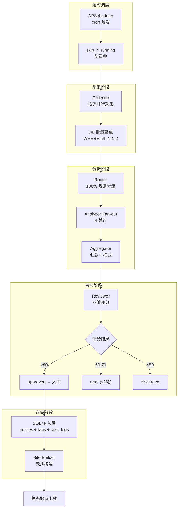
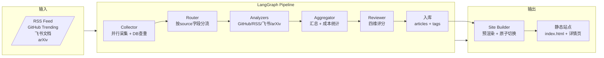
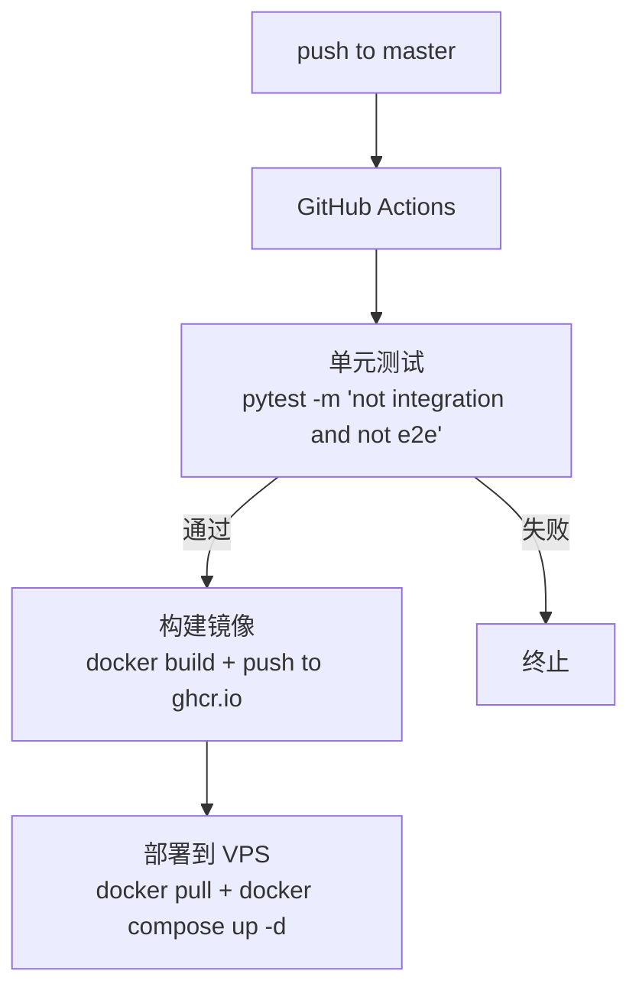

# AI Knowledge Base

个人 AI 知识库系统 — 自动采集 AI/LLM/Agent 领域资讯，经 LLM 分析审核后生成静态网站展示。

## 项目概览

| 指标 | 说明 |
|------|------|
| **技术栈** | Python 3.12+ / LangGraph / FastAPI / SQLite / Jinja2 / Chart.js |
| **部署** | Docker Compose (1C2G VPS) |
| **日均采集** | ~50 条，年数据量 ~20MB |
| **成本** | ¥85-125/月 (VPS + 域名 + LLM API) |

## 系统架构

```
┌─────────────────────────────────────────────────────────────────────┐
│                           GitHub Actions CI/CD                      │
└─────────────────────────────────────────────────────────────────────┘
                                    │
                                    ▼
┌─────────────────────────────────────────────────────────────────────┐
│                         VPS (1C2G)                                  │
│  ┌──────────────────────────────────────────────────────────────┐  │
│  │                 Docker Compose                                │  │
│  │  ┌─────────────────┐    ┌─────────────────┐                    │  │
│  │  │   pipeline      │    │      web        │                    │  │
│  │  │  (Python/FastAPI)│    │    (Caddy)     │                    │  │
│  │  │  - APScheduler  │    │  - 静态文件服务  │                    │  │
│  │  │  - LangGraph    │───▶│  - API 反向代理  │                    │  │
│  │  │  - Site Builder │    │                 │                    │  │
│  │  └─────────────────┘    └─────────────────┘                    │  │
│  │         │                       │                              │  │
│  │         ▼                       ▼                              │  │
│  │  ┌─────────────────────────────────────────────────────┐      │  │
│  │  │              ./data (SQLite)  │  ./output (静态站)   │      │  │
│  │  └─────────────────────────────────────────────────────┘      │  │
│  └──────────────────────────────────────────────────────────────┘  │
└─────────────────────────────────────────────────────────────────────┘
```

## 数据流程



### LangGraph DAG 详细流程



## 目录结构

```
ai-knowledge-base/
├── config/                     # 配置文件
│   ├── llm.yaml               #   LLM Provider 注册 (base_url, api_key, models, 价格)
│   ├── sources.yaml           #   数据源定义 (RSS/GitHub/飞书/arXiv)
│   └── agents.yaml            #   SubAgent 绑定 (primary/fallback model, params)
│
├── prompts/                    # Agent Prompt 模板
│   ├── github.md / rss.md / feishu.md / arxiv.md
│   └── reviewer.md            #   四维评分锚点 + retry 格式
│
├── src/
│   ├── main.py                # FastAPI 入口 + APScheduler
│   │
│   ├── core/                  # 基础设施
│   │   ├── config.py          #   YAML → Pydantic 配置
│   │   ├── llm_client.py     #   TrackedClient (记账 + 熔断 + fallback)
│   │   ├── budget.py          #   全局预算熔断
│   │   └── health.py          #   Provider 健康检查
│   │
│   ├── graph/                 # LangGraph 工作流
│   │   ├── pipeline.py        #   DAG 编排
│   │   ├── state.py           #   State + Pydantic 模型
│   │   ├── collector.py       #   采集 + 查重
│   │   ├── router.py          #   规则分流
│   │   ├── aggregator.py      #   汇总 + 校验
│   │   ├── reviewer.py        #   四维评分
│   │   └── analyzers/         #   4 个 Analyzer 节点
│   │
│   ├── db/                    # 数据访问层
│   │   ├── database.py        #   SQLite 连接 + migration
│   │   ├── articles.py        #   文章 CRUD + FTS5 搜索
│   │   ├── tags.py           #   标签 CRUD
│   │   ├── queries.py         #   仪表盘聚合
│   │   └── migrations/        #   版本化 SQL
│   │
│   ├── api/                   # FastAPI 路由
│   │   ├── health.py          #   /api/health
│   │   ├── search.py          #   /api/search
│   │   ├── article.py         #   /api/articles/{id}
│   │   ├── cost.py           #   /api/cost
│   │   └── pipeline.py        #   /api/pipeline
│   │
│   └── site/                  # 静态站点生成
│       ├── builder.py         #   去抖构建 + 原子切换
│       └── templates/         #   Jinja2 模板
│
├── data/                       # SQLite 数据库 (volume mount)
├── output/                     # 静态站点产物 (volume mount)
├── tests/                      # pytest 分层测试
└── docs/                       # 设计文档
```

## 快速开始

### 本地开发

```bash
# 安装依赖
uv sync

# 配置环境变量
cp .env.example .env
# 编辑 .env 填入 API 密钥

# 运行服务
uv run uvicorn src.main:app --reload

# 触发采集
curl -X POST http://localhost:8000/api/pipeline/run

# 强制构建站点
curl -X POST http://localhost:8000/api/pipeline/build
```

### 部署到 VPS

```bash
# 1. VPS 安装 Docker + Docker Compose

# 2. Clone 仓库
git clone https://github.com/kangapp/ai-knowledge-base.git
cd ai-knowledge-base

# 3. 创建 .env
cp .env.example .env
vim .env  # 填入密钥

# 4. 启动服务
docker compose up -d

# 5. 验证
curl http://localhost:8090/api/health
```

## 使用指南

### 手动触发采集

```bash
# 触发采集
curl -X POST http://localhost:8000/api/pipeline/run

# 检查状态
curl http://localhost:8000/api/pipeline/status
```

### 查看日志

```bash
# 查看 pipeline 日志 (JSON 格式)
docker logs pipeline --since 24h | grep '"event"' | jq .

# 查看错误
docker logs pipeline --since 24h | grep '"error"'

# 查看指定 run_id 的日志
docker logs pipeline --since 24h | grep '"run_id": "20260523-0900"'
```

### 查看统计数据

```bash
# 仪表盘 KPI
curl http://localhost:8000/api/stats

# 花费统计
curl http://localhost:8000/api/cost/summary?days=30

# 搜索文章
curl "http://localhost:8000/api/search?q=LLM&limit=20"

# 文章列表
curl "http://localhost:8000/api/articles?page=1&page_size=20"
```

## 运维指南

### CI/CD 流程



### 数据库迁移

迁移文件位于 `src/db/migrations/`，格式为 `001_*.sql`, `002_*.sql`...

- 启动时 `Database._run_migrations()` 自动检测并执行未应用迁移
- `schema_version` 表记录当前版本
- 迁移后版本号自动更新

### 备份与恢复

```bash
# 备份 (自动每日备份)
docker logs pipeline | grep 'backup'  # 查看备份记录

# 恢复
docker compose stop pipeline
cp data/backup/knowledge-YYYYMMDD.db data/kb.db
docker compose start pipeline
```

### 密钥轮换

```bash
# 编辑 .env
vim /opt/ai-knowledge-base/.env

# 重启服务
docker compose restart pipeline
```

### 扩展数据源

1. 在 `config/sources.yaml` 添加新数据源
2. 在 `src/graph/analyzers/` 创建对应的 Analyzer 文件
3. 在 `pipeline.py` 注册新 Analyzer 到 Router
4. 重启服务

## API 接口

| 接口 | 说明 |
|------|------|
| `GET /api/health` | 健康检查 |
| `GET /api/articles` | 文章列表 (分页) |
| `GET /api/articles/{id}` | 文章详情 |
| `GET /api/search?q=xxx` | 全文搜索 |
| `GET /api/stats` | 仪表盘统计 |
| `GET /api/cost/summary` | 花费统计 |
| `POST /api/pipeline/run` | 手动触发采集 |
| `POST /api/pipeline/build` | 强制构建站点 |

响应格式：

```json
{
  "code": 0,
  "data": { ... },
  "message": "ok"
}
```

错误码：

| code | 含义 |
|------|------|
| 0 | 成功 |
| 40001 | 参数校验失败 |
| 40401 | 资源不存在 |
| 50001 | 服务内部错误 |
| 50002 | 数据库错误 |
| 50003 | 上游 API 超时 |
| 50004 | LLM Provider 不可用 |

## 评审算法

Reviewer 采用四维评分，总分 0-100：

| 维度 | 权重 | 评分标准 |
|------|------|---------|
| AI 相关度 | 0-40 | 35-40: 核心 AI/LLM/Agent；25-34: AI 基础设施；10-24: 泛技术提及 |
| 内容深度 | 0-30 | 25-30: 深度原创；15-24: 有具体细节；5-14: 简要介绍 |
| 信息密度 | 0-15 | 12-15: 新颖/独家；7-11: 有一定信息量；0-6: 重复/营销 |
| 时效性 | 0-15 | 12-15: 本周内；7-11: 本月；0-6: 较早 |

评审结果：
- **≥80 分**: approved → 入库
- **50-79 分**: retry (最多 2 轮，带修改建议)
- **<50 分**: discarded

## 扩展与优化方向

### 短期优化

- [ ] **数据源扩展**: 添加 Twitter/X、微博、知乎专栏等社交媒体源
- [ ] **评分维度优化**: 增加"原创性"、"可操作性"等评分维度
- [ ] **缓存优化**: 引入 Redis 缓存热门搜索结果
- [ ] **监控告警**: 对采集失败率、LLM 熔断次数等指标设置告警

### 中期优化

- [ ] **增量采集**: 支持增量更新，只采集新内容
- [ ] **分布式采集**: 多节点并行采集不同数据源
- [ ] **语义去重**: 跨源同一事件允许多视角，但添加关联标识
- [ ] **历史数据挖掘**: 分析文章传播链路、热点趋势

### 长期优化

- [ ] **多语言支持**: 自动翻译非中文内容
- [ ] **个性化推荐**: 基于用户阅读历史推荐相关文章
- [ ] **自动化报告**: 自动生成周报/月报
- [ ] **知识图谱**: 将文章内容结构化为知识图谱

## 故障排查

### 采集失败

```bash
# 查看采集日志
docker logs pipeline --since 24h | grep 'collector'

# 检查数据源配置
cat config/sources.yaml

# 测试数据源连通性
curl -I <数据源URL>
```

### LLM 调用失败

```bash
# 查看熔断日志
docker logs pipeline --since 24h | grep 'circuit'

# 检查 Provider 状态
curl http://localhost:8000/api/stats

# 检查预算
curl http://localhost:8000/api/cost/summary
```

### 站点构建失败

```bash
# 查看构建日志
docker logs pipeline --since 24h | grep 'build'

# 检查 output 目录权限
ls -la output/

# 手动触发构建
curl -X POST http://localhost:8000/api/pipeline/build
```

## 相关文档

- [架构设计](docs/architecture.md) — LangGraph DAG、数据流、LLM 管理
- [目录结构](docs/structure.md) — 代码组织规范、核心约定
- [运维手册](docs/operations.md) — 部署、备份、应急处理
- [数据模型](docs/data-model.md) — 数据库 Schema、配置文件
- [Bug 记录](docs/bug-progress.md) — 问题与解决方案