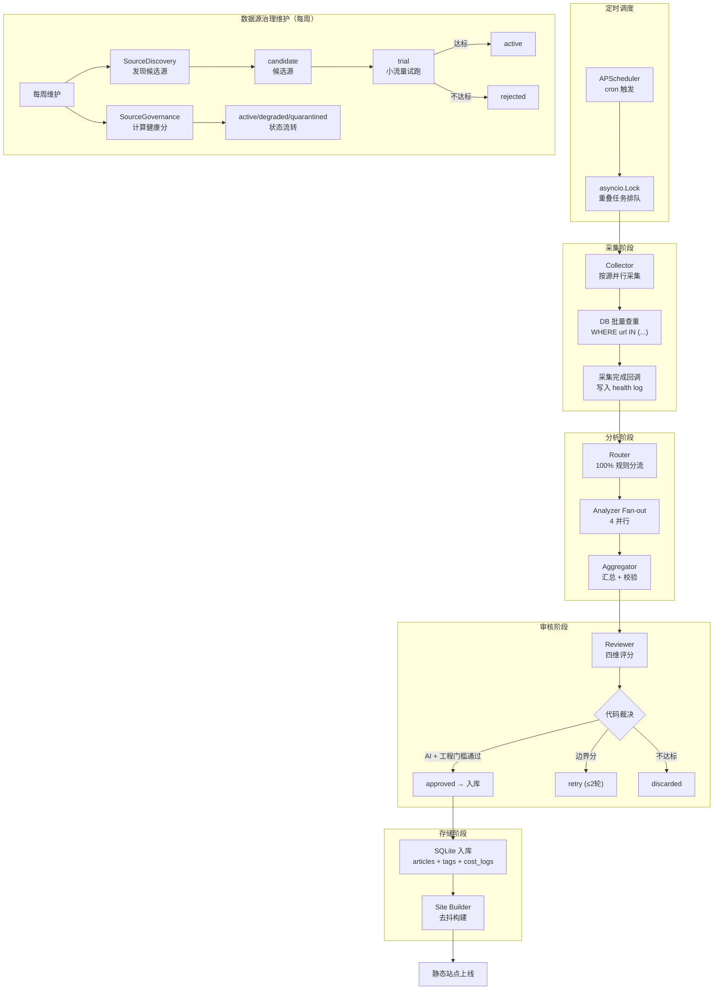
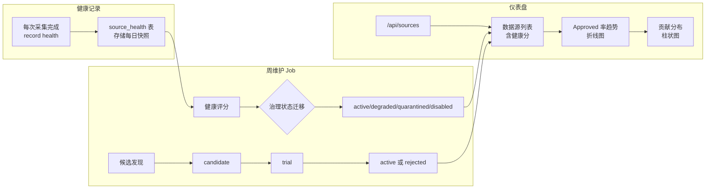
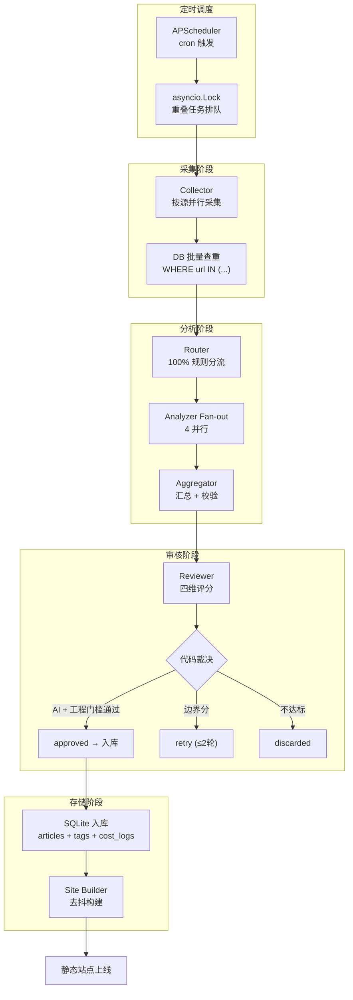
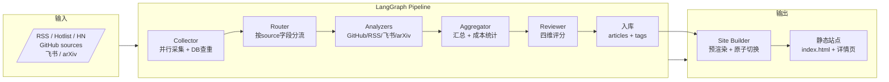
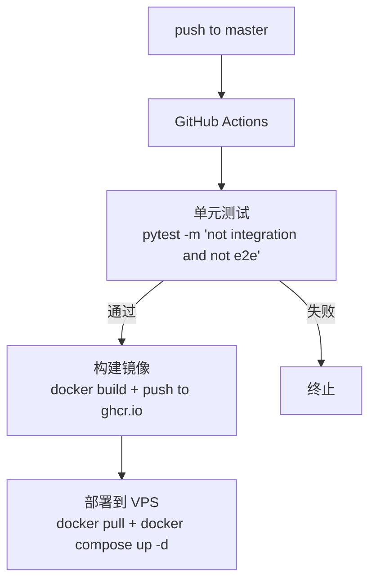

# AI Knowledge Base

个人 AI 知识库系统 — 自动采集 AI/LLM/Agent、编码、工程和基础设施领域资讯，经 LLM 分析审核后生成静态网站展示。

## 项目概览

| 指标 | 说明 |
|------|------|
| **技术栈** | Python 3.12+ / LangGraph / FastAPI / SQLite / Jinja2 / Chart.js |
| **部署** | Docker Compose (1C2G VPS) |
| **日均采集** | ~50 条，年数据量 ~20MB |
| **成本** | ¥85-125/月 (VPS + 域名 + LLM API) |

## 系统架构

```
┌─────────────────────────────────────────────────────────────────────┐
│                           GitHub Actions CI/CD                      │
└─────────────────────────────────────────────────────────────────────┘
                                    │
                                    ▼
┌─────────────────────────────────────────────────────────────────────┐
│                         VPS (1C2G)                                  │
│  ┌──────────────────────────────────────────────────────────────┐  │
│  │                 Docker Compose                                │  │
│  │  ┌─────────────────┐    ┌─────────────────┐                    │  │
│  │  │   pipeline      │    │      web        │                    │  │
│  │  │  (Python/FastAPI)│    │    (Caddy)     │                    │  │
│  │  │  - APScheduler  │    │  - 静态文件服务  │                    │  │
│  │  │  - LangGraph    │───▶│  - API 反向代理  │                    │  │
│  │  │  - Site Builder │    │                 │                    │  │
│  │  └─────────────────┘    └─────────────────┘                    │  │
│  │         │                       │                              │  │
│  │         ▼                       ▼                              │  │
│  │  ┌─────────────────────────────────────────────────────┐      │  │
│  │  │              ./data (SQLite)  │  ./output (静态站)   │      │  │
│  │  └─────────────────────────────────────────────────────┘      │  │
│  └──────────────────────────────────────────────────────────────┘  │
└─────────────────────────────────────────────────────────────────────┘
```

## 完整数据流程



### 数据源健康管理系统



## 数据流程



### LangGraph DAG 详细流程



## 目录结构

```
ai-knowledge-base/
├── config/                     # 配置文件
│   ├── llm.yaml               #   LLM Provider 注册 (base_url, api_key, models, 价格)
│   ├── sources.yaml           #   数据源定义 (RSS/Hotlist/HN/GitHub/飞书/arXiv)
│   └── agents.yaml            #   SubAgent 绑定 (primary/fallback model, params)
│
├── prompts/                    # Agent Prompt 模板
│   ├── github_analyzer.md / rss_analyzer.md / feishu_analyzer.md / arxiv_analyzer.md
│   ├── reviewer.md            #   普通文章 AI + 工程四维评分
│   ├── github_reviewer.md     #   GitHub repo-aware 审核（含数据工程基础设施）
│   └── deep_report.md         #   GitHub 源码级深度报告
│
├── src/
│   ├── main.py                # FastAPI 入口 + APScheduler + pipeline 排队锁
│   │
│   ├── core/                  # 基础设施
│   │   ├── config.py          #   YAML → Pydantic 配置
│   │   ├── llm_client.py     #   TrackedClient (记账 + 熔断 + fallback)
│   │   ├── budget.py          #   全局预算熔断
│   │   ├── health.py          #   Provider 健康检查
│   │   ├── source_health.py   #   数据源健康追踪 + 淘汰逻辑
│   │   ├── source_manager.py  #   sources.yaml 读写 + 增删操作
│   │   └── source_discovery.py #   发现策略 (GitHub Topic / RSS 友链)
│   │
│   ├── graph/                 # LangGraph 工作流
│   │   ├── pipeline.py        #   DAG 编排
│   │   ├── state.py           #   State + Pydantic 模型
│   │   ├── collector.py       #   采集 + 查重
│   │   ├── router.py          #   规则分流
│   │   ├── aggregator.py      #   汇总 + 校验
│   │   ├── reviewer.py        #   四维评分
│   │   └── analyzers/         #   4 个 Analyzer 节点
│   │
│   ├── db/                    # 数据访问层
│   │   ├── operations.py      #   兼容入口 + 统计/备份/source health/GitHub 快照查询
│   │   ├── articles.py        #   文章保存、标签、查重、搜索和详情
│   │   ├── pipeline_ops.py    #   pipeline run/event/source run/collection item 写入
│   │   ├── costs.py           #   LLM 成本记录和当日花费对账
│   │   ├── deep_report_ops.py #   Deep Reports CRUD 和公开版本切换
│   │   ├── common.py          #   DB 子模块共享的小工具
│   │   └── migrations/        #   版本化 SQL
│   │
│   ├── api/                   # FastAPI 路由
│   │   ├── responses.py       #   统一响应信封 + 错误码
│   │   ├── routes.py          #   文章/搜索/基础统计/pipeline/health
│   │   ├── stats.py           #   仪表盘统计接口
│   │   ├── dashboard.py       #   首屏 KPI 聚合
│   │   ├── sources.py         #   数据源管理与健康统计
│   │   ├── deep_reports.py    #   Deep Reports 公开接口
│   │   └── config.py          #   配置查看接口
│   │
│   ├── scheduler/             # 定时任务
│   │   └── source_scheduler.py #   每周数据源健康维护 Job
│   │
│   └── site/                  # 静态站点生成
│       ├── builder.py         #   去抖构建 + 原子切换
│       └── templates/         #   Jinja2 模板
│
├── data/                       # SQLite 数据库 (volume mount)
├── output/                     # 静态站点产物 (volume mount)
├── tests/                      # pytest 分层测试
└── docs/                       # 设计文档
```

## 数据模型

### 数据库表

| 表名 | 说明 | 关键字段 |
|------|------|----------|
| `articles` | 文章主表 | title, url (UNIQUE), description, summary, source, relevance_score, status, collected_at |
| `tags` | 标签字典 | name (UNIQUE) |
| `article_tags` | 文章-标签关联 | article_id → articles.id, tag_id → tags.id |
| `pipeline_runs` | 流水线运行记录 | id, started_at, ended_at, status, trigger, summary (JSON) |
| `cost_logs` | LLM 调用花费 | run_id, agent, provider, model, tokens_in, tokens_out, cost, **ref_url** |
| `provider_health` | Provider 健康状态 | provider, status, latency_ms, circuit (closed/open/half_open) |
| `circuit_events` | 熔断事件记录 | provider, event, reason, created_at |
| `source_health` | 数据源健康快照 | source_id, date, total_collected, approved, rejected, avg_score |
| `discovered_sources` | 已发现待审核的数据源 | url, name, type, status (candidate/added/rejected) |

**FTS5 全文索引**：`articles_fts` over (title, summary, description)

### extra_data JSON 结构

`articles.extra_data` 存储 Reviewer 四维评分。普通文章新写入 `ai_relevance/engineering_relevance/content_depth/info_density`；GitHub repo 默认使用 `ai_relevance/developer_utility/project_signal/content_clarity`；`github_data_infra` 使用 `data_infra_relevance/developer_utility/project_signal/content_clarity`。

```json
{
  "dimensions": {
    "ai_relevance": {"score": 25, "reason": "..."},
    "engineering_relevance": {"score": 26, "reason": "..."},
    "content_depth": {"score": 22, "reason": "..."},
    "info_density": {"score": 12, "reason": "..."}
  }
}
```

### Dashboard API 端点

| 端点 | 说明 | 返回字段 |
|------|------|----------|
| `GET /api/stats/quality-detail?period=week` | 数据质量详细统计 | content_quality, audit_efficiency, tag_coverage, dimensions, reason_keywords |
| `GET /api/stats/consumption-detail?period=month` | 资源消耗详细统计 | period_cost, daily_avg, cost_per_million_tokens, budget_progress, trend, source_trend, provider_trend |

### 采集流程产生的数据

```
每次采集产生一条 pipeline_runs 记录
    └── cost_logs: 每次 LLM 调用产生一条记录（记录 ref_url 用于追踪来源）
    └── articles: 入库时产生记录，status = approved/retry/discarded，extra_data 存储四维评分
    └── source_health / source_health_daily: 记录 source 级健康和每日治理评分
```

### sources.yaml 配置结构

```yaml
sources:
  - id: github_trending
    name: GitHub Trending
    type: github
    enabled: true
    priority: 1
    cron: "0 */6 * * *"
    max_items: 10
    config:
      languages: [python, typescript]
      topics: [ai, llm, agent]

  - id: github_ai_devtools
    name: GitHub AI 开发工具
    type: github
    enabled: true
    cron: "0 */6 * * *"
    max_items: 10
    config:
      topics: []
      keywords: ["interactive knowledge graph", "codebase knowledge graph", "code understanding", "codebase understanding", "repository analysis"]
      lookback_type: pushed
      lookback_days: 90
      min_stars: 100

  - id: github_data_infra
    name: GitHub 数据工程基础设施
    type: github
    enabled: true
    cron: "0 */6 * * *"
    max_items: 10
    config:
      keywords: ["dbt", "SQLMesh", "data lineage", "data catalog", "data quality"]
      lookback_type: pushed
      lookback_days: 90
      min_stars: 100

  - id: hotlist_aihot
    name: AIHot
    type: hotlist
    enabled: true
    cron: "0 */2 * * *"
    max_items: 10
    config:
      api_url: "https://newsnow.busiyi.world/api/s"
      platform_id: "aihot"
      filter_keywords: [AI, LLM, Agent, RAG, MCP, OpenAI, 大模型, 人工智能]
      filter_scope: title_summary

  - id: rss_techcrunch
    name: TechCrunch AI
    type: rss
    enabled: true
    cron: "0 */6 * * *"
    max_items: 10
    config:
      url: "https://techcrunch.com/feed/"
```

### agents.yaml 配置结构

```yaml
budget:
  monthly: 10.0          # 月预算 ($)
  soft_limit: 0.8        # 80% 触发软熔断

agents:
  github_analyzer:
    primary:
      provider: deepseek
      model: deepseek-chat
    fallback:
      - provider: minimax
        model: MiniMax-M3
    prompt: prompts/github.md
    budget_weight: 1.0
```

## 快速开始

### 本地开发

```bash
# 安装依赖
uv sync

# 配置环境变量
cp .env.example .env
# 编辑 .env 填入 API 密钥

# 运行服务
uv run uvicorn src.main:app --reload

# 触发采集
curl -X POST http://localhost:8000/api/pipeline/run

# 强制构建站点
curl -X POST http://localhost:8000/api/pipeline/build
```

### 部署到 VPS

```bash
# 1. VPS 安装 Docker + Docker Compose

# 2. Clone 仓库
git clone https://github.com/kangapp/ai-knowledge-base.git
cd ai-knowledge-base

# 3. 创建 .env
cp .env.example .env
vim .env  # 填入密钥

# 4. 启动服务
docker compose up -d

# 5. 验证
curl http://localhost:8090/api/health
```

## 使用指南

### 手动触发采集

```bash
# 全量采集（所有已启用的数据源）
curl -X POST http://localhost:8000/api/pipeline/run

# 指定数据源采集（按 source id）
curl -X POST "http://localhost:8000/api/pipeline/run?source=github_trending"

# 指定多个源（多次调用）
curl -X POST "http://localhost:8000/api/pipeline/run?source=hn_ai"
```

**查看已配置的数据源 ID：**
```bash
curl http://localhost:8000/api/sources
```

### 查看状态和日志

```bash
# 查看 DAG 状态（当前运行阶段和日志）
curl http://localhost:8000/api/pipeline/dag

# 查看 pipeline 日志 (JSON 格式)
docker logs pipeline --since 24h | grep '"event"' | jq .

# 查看错误
docker logs pipeline --since 24h | grep '"error"'

# 查看指定 run_id 的日志
docker logs pipeline --since 24h | grep '"run_id": "20260523-0900"'
```

### 数据源管理

```bash
# 查看所有数据源（含健康状态）
curl http://localhost:8000/api/sources

# 查看数据源健康统计
curl http://localhost:8000/api/sources/stats

# 查看已发现待审核的数据源
curl http://localhost:8000/api/sources/discovered

# 启用/禁用数据源
curl -X POST "http://localhost:8000/api/sources/{source_id}/action?action=enable"
curl -X POST "http://localhost:8000/api/sources/{source_id}/action?action=disable"
```

### 查看统计数据

```bash
# 仪表盘 KPI（30天）
curl http://localhost:8000/api/stats

# 指定天数
curl http://localhost:8000/api/stats?days=7

# 花费统计
curl http://localhost:8000/api/cost/summary?days=30

# 搜索文章
curl "http://localhost:8000/api/search?q=LLM&limit=20"

# 文章列表（支持分页、来源筛选）
curl "http://localhost:8000/api/articles?page=1&page_size=20&source=github"

# 按来源筛选
curl "http://localhost:8000/api/articles?source=rss"
```

### 强制构建站点

```bash
# 强制重新构建静态站点（跳过去抖）
curl -X POST http://localhost:8000/api/pipeline/build
```

## 运维指南

### CI/CD 流程



### 数据库迁移

迁移文件位于 `src/db/migrations/`，格式为 `001_*.sql`, `002_*.sql`...

- 启动时 `Database._run_migrations()` 自动检测并执行未应用迁移
- `schema_version` 表记录当前版本
- 迁移后版本号自动更新

### 备份与恢复

```bash
# 备份 (自动每日备份)
docker logs pipeline | grep 'backup'  # 查看备份记录

# 恢复
docker compose stop pipeline
cp data/backup/knowledge-YYYYMMDD.db data/kb.db
docker compose start pipeline
```

### 密钥轮换

```bash
# 编辑 .env
vim /opt/ai-knowledge-base/.env

# 重启服务
docker compose restart pipeline
```

### 扩展数据源

数据源支持手动和自动两种扩展方式：

**手动添加**：编辑 `config/sources.yaml`

**自动发现（每周维护）**：
1. **GitHub / RSS 候选发现** — 从 GitHub 搜索、Trending topic、RSS 邻居和已通过文章反推候选源
2. **候选试跑** — 候选源先进入 `candidate`，再转 `trial` 小流量试跑，不直接上线为正式源

**自动治理**：
- 数据源按健康分在 `active/degraded/quarantined/disabled` 等状态间流转
- `trial` 源最近健康记录达标后转 `active`，否则转 `rejected`
- 预算阻断单独记录为 `budget_blocked`，不降低数据源质量分

## API 接口

| 接口 | 说明 |
|------|------|
| `GET /api/health` | 健康检查 |
| `GET /api/articles` | 文章列表 (分页) |
| `GET /api/articles/{id}` | 文章详情 |
| `GET /api/search?q=xxx` | 全文搜索 |
| `GET /api/stats` | 仪表盘统计 |
| `GET /api/cost/summary` | 花费统计 |
| `POST /api/pipeline/run` | 手动触发采集 |
| `POST /api/pipeline/build` | 强制构建站点 |
| `GET /api/sources` | 数据源列表（含健康状态） |
| `GET /api/sources/stats` | 数据源健康统计 |
| `GET /api/sources/discovered` | 已发现待审核的数据源 |
| `GET /api/stats/quality-detail?period=week` | 数据质量详细统计（四维评分、Reason关键词） |
| `GET /api/stats/consumption-detail?period=month` | 资源消耗详细统计（费用趋势、Provider分解） |
| `POST /api/sources/{id}/action` | 数据源操作（enable/disable/remove） |

响应格式：

```json
{
  "code": 0,
  "data": { ... },
  "message": "ok"
}
```

错误码：

| code | 含义 |
|------|------|
| 0 | 成功 |
| 40001 | 参数校验失败 |
| 40401 | 资源不存在 |
| 50001 | 服务内部错误 |
| 50002 | 数据库错误 |
| 50003 | 上游 API 超时 |
| 50004 | LLM Provider 不可用 |

## 评审算法

Reviewer 采用 source-aware 四维评分，总分 0-100；模型只给分数草稿，最终 verdict 由代码按阈值重算。

普通文章：

| 维度 | 权重 | 评分标准 |
|------|------|---------|
| AI 相关度 | 0-30 | 24-30: 核心 AI/LLM/Agent/MCP/RAG；18-23: AI 基础设施；8-17: 泛泛提及 |
| 工程相关度 | 0-30 | 24-30: 编码/工程/AI infra/数据工程；18-23: 有工程线索；0-17: 偏产品、商业或应用新闻 |
| 内容深度 | 0-25 | 21-25: 深度原创；13-20: 有具体细节；5-12: 简要介绍 |
| 信息密度 | 0-15 | 12-15: 新颖/独家；7-11: 有一定信息量；0-6: 重复/营销 |

GitHub repo：

| 来源 | 维度 |
|------|------|
| 默认 GitHub | `ai_relevance / developer_utility / project_signal / content_clarity` |
| `github_data_infra` | `data_infra_relevance / developer_utility / project_signal / content_clarity` |

评审结果：
- 普通文章：`ai_relevance < 18` 直接 discarded；`total_score >= 70 && engineering_relevance >= 22` 才 approved；边界分 retry。
- 默认 GitHub：要求 AI 相关度、开发者实用性和项目信号达标。
- `github_data_infra`：不看 AI 相关度，要求数据工程基础设施相关度和实用性达标。

## LLM 交互流程

### Prompt 模板内容

#### github_analyzer.md
```
分析以下 GitHub 仓库，输出 JSON（不要 markdown 包裹）。

仓库: {title}
描述: {description}
URL: {url}
元数据: {metadata}

输出 JSON (schema={schema})
标签从 AI/LLM/Agent/MCP/RAG/Open Source/Tool/Framework/Benchmark 中选择，也可建议新标签。
```

#### rss_analyzer.md
```
分析以下技术文章，输出 JSON（不要 markdown 包裹）。

文章: {title}
摘要: {description}
链接: {url}
来源: {metadata}

输出 JSON (schema={schema})
```

#### feishu_analyzer.md
```
分析以下飞书文档，输出 JSON（不要 markdown 包裹）。

飞书文档: {title}
内容: {description}
元数据: {metadata}

输出 JSON (schema={schema})
```

#### arxiv_analyzer.md
```
分析以下学术论文摘要，输出 JSON（不要 markdown 包裹）。

论文: {title}
摘要: {description}
URL: {url}
分类: {metadata}

输出 JSON (schema={schema})
```

#### reviewer.md
```
你是内容审核员。对文章按四维评分（0-100）:
- AI相关度(0-30): 核心AI/LLM/Agent/MCP/RAG=24-30, AI基础设施=18-23, 泛泛提及=8-17, 无关=0-7
- 工程相关度engineering_relevance(0-30): 编码/开发工具/工程实践/AI infra/数据工程=24-30, 有工程线索=18-23, 无工程价值=0-7
- 内容深度(0-25): 深度原创=21-25, 有细节=13-20, 简要=5-12, 空内容=0-4
- 信息密度info_density(0-15): 新颖独家=12-15, 有信息量=7-11, 重复营销=0-6

输出 JSON:
{ "total_score": 85, "dimensions": { "ai_relevance": {"score": 25, "reason": "..."}, "engineering_relevance": {"score": 25, "reason": "..."}, "content_depth": {"score": 23, "reason": "..."}, "info_density": {"score": 12, "reason": "..."} }, "verdict": "approved"|"retry"|"discarded", "retry_feedback": null|{"suggestions": ["..."]} }
```

### Agent 配置

| Agent | Prompt 文件 | Primary Model | Fallback | temperature | max_tokens |
|-------|------------|---------------|----------|-------------|------------|
| `github_analyzer` | `prompts/github_analyzer.md` | MiniMax-M3 | deepseek-chat | 0.3 | 2048 |
| `rss_analyzer` | `prompts/rss_analyzer.md` | MiniMax-M3 | — | 0.3 | 2048 |
| `feishu_analyzer` | `prompts/feishu_analyzer.md` | MiniMax-M3 | — | 0.3 | 2048 |
| `arxiv_analyzer` | `prompts/arxiv_analyzer.md` | MiniMax-M3 | deepseek-chat | 0.3 | 4096 |
| `reviewer` | `prompts/reviewer.md` | MiniMax-M3 | — | 0.0 | 1024 |

### 完整数据流

```
采集阶段（Collector）
    │
    ▼
路由阶段（Router）── 100% 规则分流
    │
    ├── github ──▶ github_analyzer ──prompts/github_analyzer.md──┐
    ├── rss/hotlist/hn ─▶ rss_analyzer ─prompts/rss_analyzer.md──┤
    ├── feishu ──▶ feishu_analyzer ──prompts/feishu_analyzer.md─┤──▶ Aggregator（汇总）
    └── arxiv  ──▶ arxiv_analyzer  ──prompts/arxiv_analyzer.md─┘
                                                                  │
                                                                  ▼
                                                              Reviewer
                                ┌──────────────────prompts/reviewer.md──▶ 普通文章 AI + 工程评分
                                └─────────────prompts/github_reviewer.md──▶ GitHub repo-aware 评分
                                                                  │
                                        ┌──────────────────┬─────┴─────┐
                                        ▼                  ▼            ▼
                                    approved 入库      retry      discarded
                                                     (最多 2 轮)
```

### Prompt 填充与调用

1. `load_prompt(agent_name, registry)` 从 `config/agents.yaml` 读取 `prompt` 路径，加载 `prompts/*.md` 文件
2. 用户消息用 Python `.format()` 填充占位符：`{title}` `{description}` `{url}` `{metadata}` `{schema}`
3. System prompt 默认：`"你是一个技术分析助手。只输出 JSON，格式：{schema}"`
4. 调用 `Chat Completions API`，`response_format={"type": "json_object"}`（仅对支持 json_mode 的 provider 传入）
5. 响应通过 `parse_and_validate()` 解析：剥离 markdown 包裹、思考标签，提取 JSON

### Analyzer 输出 Schema

```json
{
  "title": "string - 标题",
  "summary": "string - 100-200字中文摘要",
  "tags": ["标签1", "标签2"] - 最多3个，从 AI/LLM/Agent/MCP/RAG/Open Source/Tool/Framework/Benchmark 选择",
  "language": "zh|en - 文章语言"
}
```

> relevance_score 已移除 — Analyzer 不生成相关度分数，分数由 Reviewer 的四维评分决定

### Reviewer 输出 Schema

```json
{
  "total_score": 85,
  "dimensions": {
    "ai_relevance": {"score": 25, "reason": "..."},
    "engineering_relevance": {"score": 25, "reason": "..."},
    "content_depth": {"score": 23, "reason": "..."},
    "info_density": {"score": 12, "reason": "..."}
  },
  "verdict": "approved|retry|discarded",
  "retry_feedback": null | {"suggestions": ["..."]}
}
```

### 错误处理与重试

| 场景 | 处理方式 |
|------|---------|
| Analyzer parse 失败 | 重试一次（最多 2 轮），仍失败则跳过该条，记录 warning |
| LLM Provider 熔断 | 自动切换 fallback provider，无 fallback 则跳过 |
| Reviewer verdict=retry | 返回修改建议，只重审 Reviewer，最多 2 轮 |
| Reviewer verdict=discarded | 直接丢弃，不入库 |

### Prompt 扩展

新增 Analyzer 步骤：
1. 在 `prompts/` 添加 `xxx_analyzer.md`，使用 `{title}` `{description}` `{url}` `{metadata}` `{schema}` 占位符
2. 在 `config/agents.yaml` 注册 agent，指定 `prompt: prompts/xxx_analyzer.md`
3. 在 `src/graph/analyzers/` 添加 `xxx.py`，调用 `load_prompt("xxx_analyzer", registry)`
4. 在 `pipeline.py` 的 `continue_to_analyzers()` 中添加路由分支

## 扩展与优化方向

### 短期优化

- [ ] **数据源扩展**: 添加 Twitter/X、微博、知乎专栏等社交媒体源
- [ ] **评分策略校准**: 根据线上误杀/误收样本调整各 source 的阈值
- [ ] **缓存优化**: 引入 Redis 缓存热门搜索结果
- [ ] **监控告警**: 对采集失败率、LLM 熔断次数等指标设置告警

### 中期优化

- [ ] **增量采集**: 支持增量更新，只采集新内容
- [ ] **分布式采集**: 多节点并行采集不同数据源
- [ ] **语义去重**: 跨源同一事件允许多视角，但添加关联标识
- [ ] **历史数据挖掘**: 分析文章传播链路、热点趋势

### 长期优化

- [ ] **多语言支持**: 自动翻译非中文内容
- [ ] **个性化推荐**: 基于用户阅读历史推荐相关文章
- [ ] **自动化报告**: 自动生成周报/月报
- [ ] **知识图谱**: 将文章内容结构化为知识图谱

## 故障排查

### 采集失败

```bash
# 查看采集日志
docker logs pipeline --since 24h | grep 'collector'

# 检查数据源配置
cat config/sources.yaml

# 测试数据源连通性
curl -I <数据源URL>
```

### LLM 调用失败

```bash
# 查看熔断日志
docker logs pipeline --since 24h | grep 'circuit'

# 检查 Provider 状态
curl http://localhost:8000/api/stats

# 检查预算
curl http://localhost:8000/api/cost/summary
```

### 站点构建失败

```bash
# 查看构建日志
docker logs pipeline --since 24h | grep 'build'

# 检查 output 目录权限
ls -la output/

# 手动触发构建
curl -X POST http://localhost:8000/api/pipeline/build
```

## 相关文档

- [架构设计](docs/analysis/architecture/architecture.md) — LangGraph DAG、数据流、LLM 管理
- [目录结构](docs/structure.md) — 代码组织规范、核心约定
- [运维手册](docs/operations.md) — 部署、备份、应急处理
- [数据模型](docs/data-model.md) — 数据库 Schema、配置文件
- [Bug 记录](docs/bug-progress.md) — 问题与解决方案
