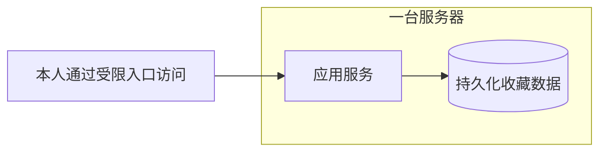

# 和 AI 共创项目的指南

面向有基础编程能力的独立开发者：你作关键决定，AI 推进工作与验证，从零共创一个可上线、可维护的项目。

## 1. 启动项目共创

填入项目想法，有现成材料时一起提供，将以下提示词复制到 AI 对话中。已有 Spec 时直接作为材料提供，沿用已经确认的需求。

<button type="button" class="prompt-copy" data-copy-target="project-starter" aria-describedby="copy-feedback" hidden>复制启动提示词</button>

查看与修改启动提示词

<pre id="project-starter" class="starter-prompt"><code>我想与你从零共创一个可上线、可维护的项目。
我有基础编程能力，由你推进工作，我作关键决定。

初步想法：{想解决什么问题，为谁使用}
已有材料与约束：{可选，如代码、预算、时间、运行环境}

请主持“需求与 Spec → 技术选型 → 编码与测试 → 部署上线 → 运维迭代”。

协作方式：
- 每轮只处理一个主要决定，提供 2–3 个选项，说明推荐前提与主要影响。
- 允许我自定义答案或暂时保留问题，不把沉默当成确认。
- 能查证、实现和常规修正的内容由你完成；影响范围、成本和核心行为的取舍由我决定。
- 持续维护已确认决定、假设、待定问题和当前产物，沿用已有共识。

推进方式：
- 先形成最小必要的 Spec 和验收条件，再安排实施顺序。
- 技术选型结合实际约束，说明选择理由、主要代价和适用边界。
- 按可验证的小步编码，每步完成必要测试，再继续下一步。
- 部署前明确目标环境、配置、验收与回滚方式，按已确认的授权执行。
- 上线后明确如何检查运行状态、定位故障、备份恢复和发布更新。

交付要求：
- 保持需求、代码、测试和运行说明一致。
- 区分设计建议、已完成实现和实际验证结果；未执行的检查明确标记。
- 发现失败先定位原因；涉及新的关键取舍时，回来与我澄清。
- 用必要的图表解释架构、流程或部署关系，并核对图文一致性。
- 每轮简短说明产物、验证结果、待定事项和下一步。
- 最终交付代码、必要文档及运行维护说明，列出剩余问题。

现在先复述你的理解，提出第一个需要我决定的问题。</code></pre>

## 2. 从想法到持续运行

每个阶段都留下明确产物，用验证结果判断能否继续。AI 负责推进和检查，你负责关键取舍。

<table>
<thead><tr><th scope="col">阶段</th><th scope="col">AI 负责</th><th scope="col">你决定</th><th scope="col">产物与完成条件</th></tr></thead>
<tbody>
<tr><th scope="row">需求与 Spec</th><td>查阅材料，澄清场景，整理规则、边界和验收条件。</td><td>为谁解决什么问题，优先做什么、本次不做什么。</td><td><strong>最小必要 Spec。</strong>核心行为明确，没有阻塞下一步的关键歧义。</td></tr>
<tr><th scope="row">技术选型</th><td>结合预算、规模和已有能力比较方案；对不确定的关键依赖做必要验证。</td><td>在开发速度、成本、复杂度和维护负担之间取舍。</td><td><strong>选型记录与架构简图。</strong>选择有依据，关键路径能跑通。</td></tr>
<tr><th scope="row">编码与测试</th><td>按验收条件拆分小步，实现代码、执行测试、修正问题并同步文档。</td><td>实际行为是否符合预期，以及新出现的业务取舍。</td><td><strong>可运行的功能增量。</strong>必要的正常、异常和边界检查通过，结果可追溯。</td></tr>
<tr><th scope="row">部署上线</th><td>准备环境与配置，检查数据持久化，按授权发布，验证访问与核心功能。</td><td>目标环境、运行成本及可接受的发布风险。</td><td><strong>线上版本与部署说明。</strong>目标环境验收通过；涉及数据变更时，备份和恢复办法明确。</td></tr>
<tr><th scope="row">运维迭代</th><td>检查运行状态，结合日志定位故障，提出修复并验证；维护运行说明。</td><td>可接受的中断、数据损失范围，以及维护投入和迭代优先级。</td><td><strong>运行维护手册与变更记录。</strong>知道如何发现故障、恢复服务和验证更新；有持久数据时，备份恢复经过验证。</td></tr>
</tbody>
</table>

表 1：项目推进总览。窄屏可在表内横向滚动，查看完整分工与完成条件。

实际推进时，持续执行这个小循环：

**完成一小步 → AI 验证 → 你体验或确认关键取舍 → 修正 → 继续。**

普通编码、测试、文档同步和已授权操作由 AI 直接完成。只有出现新的范围、成本或核心行为变化时，才回来讨论；已经确认的事项继续沿用。

关键验收失败时，先定位和修复，再推进依赖它的工作。非阻塞问题单独记录，可以继续不受影响的部分。**“准备了测试或回滚方案”不等于“已经验证通过”**，文档中应分别记录。

## 3. 一个项目的共创示例

以“个人收藏工具”为例，观察一次技术决定怎样贯穿编码、部署和运维。以下是教学设定与验证计划，不代表已实施或已测试。

**已有约定**

仅本人使用，先支持添加链接、查看列表和取消收藏。重复收藏不新增记录，保存失败不能显示成功；预算有限，希望维护简单。

**AI 提供技术选项，你作决定**

<strong>A．应用与数据库部署在同一台服务器，推荐。</strong>适合当前功能集中、访问量小的情况，部署环节较少；需要关注服务器故障时的数据恢复。

<strong>B．应用与数据库分别部署。</strong>适合需要独立管理或扩展数据库的情况，但会增加连接配置、费用和排查环节。

<strong>示例用户选择 A。</strong>AI 记录选择、理由与适用边界，并补充：访问范围限定为本人，数据使用持久化存储。

下面的示意图用于说明部署边界，避免把应用重启与数据清空混为一谈：

图 1：授权成功时的访问路径与部署边界。访问拒绝、日志和备份路径未画出，相关验证见下表；窄屏可在图内横向滚动。

应用与数据虽然在同一台服务器上，仍需分别考虑版本发布和数据恢复；同机持久化也不能代替备份。

**AI 将决定落实到各个阶段**

<table>
<thead><tr><th scope="col">环节</th><th scope="col">AI 形成的产物</th><th scope="col">如何验证</th></tr></thead>
<tbody>
<tr><th scope="row">技术选型</th><td>选型记录、部署示意，以及适合当前约束的框架和存储方案。</td><td>运行最小程序，完成一次数据写入与读取；记录实际结果。</td></tr>
<tr><th scope="row">编码与测试</th><td>添加、查看和取消收藏的代码及必要测试。</td><td>首次收藏可见，取消后刷新不再显示；重复请求不新增记录；保存失败如实反馈。</td></tr>
<tr><th scope="row">部署上线</th><td>环境配置、发布步骤、访问限制、持久化与回滚说明。</td><td>在目标环境操作核心功能；重启应用后数据仍在；未经授权的访问被拒绝。</td></tr>
<tr><th scope="row">运维迭代</th><td>健康检查、日志入口、备份恢复步骤与变更记录。</td><td>能通过日志定位失败；在隔离环境恢复备份并核对数据；更新后重新执行核心验收。</td></tr>
</tbody>
</table>

表 2：案例验证计划，全部待执行。具体框架、存储产品、访问控制和备份安排，需要在实际项目的约束下选择。

若新版本导致收藏失败，AI 先检查运行状态、日志和最近变更，再提出修复或回滚方案。**涉及数据结构变化时，必须单独核对数据兼容与恢复方式，不能只退回旧代码。**

这个案例的交付终点是：功能符合约定、目标环境可用，并且知道发生故障后如何恢复。

按需参考：选型、编码、发布与运维

<ul>
<li><a href="prompts.html">项目 Prompt 工具箱</a>：10 个按阶段选用的可复制模板，结合 OpenAI 官方提示建议。</li>
<li><a href="reference.html#selection">选型比较与决定记录</a>：按约束比较，保留依据和待验证项。</li>
<li><a href="reference.html#coding">编码与验证检查</a>：用可运行的小步连接需求与测试。</li>
<li><a href="reference.html#release">上线与回滚检查</a>：明确发布目标、成功标准和恢复路径。</li>
<li><a href="reference.html#operations">运维与变更记录</a>：将故障发现、排查、恢复和更新写成可执行说明。</li>
<li><a href="../ai-spec-guide/index.html">和 AI 共创 Spec 的指南</a>：需求模糊时，先把规则和验收条件说明白。</li>
</ul>

依据与适用说明

本指南面向个人项目，从零创建为主，已有项目可从当前阶段接续，并先核对现状和历史约束。案例说明共创方法，不是可直接上线的完整项目。

资料核对：2026-09-15。<a href="https://learn.chatgpt.com/docs/prompting#use-editor-context">OpenAI 官方提示指南</a>强调说明目标行为、提供相关代码或复现材料、保留关键约束，并约定如何验证。本指南据此组织协作提示；项目五阶段及检查清单是实践整理，不是 OpenAI 发布的项目交付标准。

