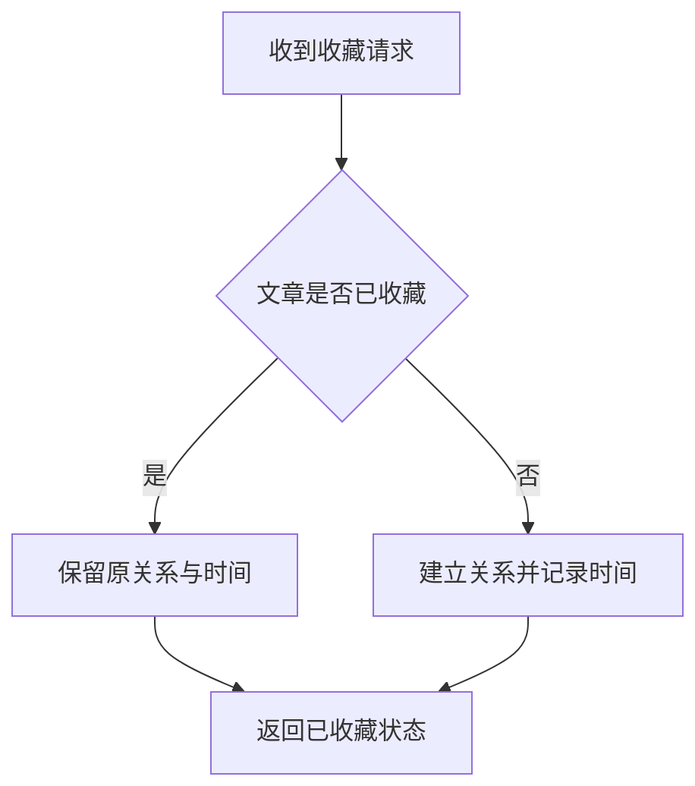

# 和 AI 共创 Spec 的指南

面向已有 Spec 编写经验的产品和研发人员：你作关键决定，AI 主持澄清、写作与审校，共同形成可以交付实施的文档。

## 1. 启动协作

填入你的想法，有现成材料时一起提供。复制到 AI 对话中，即可开始；需求设计、实现设计和业务逻辑说明都可以使用这套流程。

<button type="button" class="prompt-copy" data-copy-target="spec-starter" aria-describedby="copy-feedback" hidden>复制启动提示词</button>

查看与修改启动提示词

<pre id="spec-starter" class="starter-prompt"><code>我想与你共创一份可以交付实施的 Spec。

初步想法：{描述想解决的问题}
已有材料与约束：{可选，提供文档、代码或已知限制}

请主持“对齐目标 → 澄清需求 → 确认结构 → 逐节共创 → 审校定稿”。

协作方式：
- 每轮只讨论一个主要决定，提供 2–3 个选项，说明推荐前提与主要影响。
- 允许我自定义答案或暂时保留问题，不把沉默当成确认。
- 能查证、整理和修正的内容由你直接完成；关键业务取舍由我决定。
- 持续维护已确认决定、待定问题和当前草稿，默认只展示本轮相关内容。

生成文档：
- 先提出简洁大纲，说明各章职责，经我确认后逐节生成。
- 正文围绕主题展开，段落各有中心，规则写清条件、行为和结果。
- 按表达需要选择并生成图表或示意图，说明用途，检查图文一致性。
- 根据反馈修改相关部分，发现关键歧义时返回澄清。

交付要求：
- 核心需求有明确规则，覆盖必要的边界、异常和验收条件。
- 检查遗漏、矛盾、无依据的假设，以及阻塞实施的待定事项。
- 完成常规修正，将需要我决定的问题逐项提出，再形成最终文档。

现在先复述你的理解，提出第一个需要我决定的问题。</code></pre>

## 2. 五步共创流程

每一步都留下明确产物，并以完成条件决定是否继续。

<ol class="spec-workflow" aria-label="Spec 共创的五个步骤">
<li><strong>对齐目标</strong>AI 读取材料，概括问题、用途、范围与约束。<small>你决定：目标、优先级、本次不做什么。</small><b>产物：任务摘要。</b>清楚说明为谁解决什么问题。</li>
<li><strong>澄清需求</strong>AI 找出关键歧义，用具体场景提出选项、推荐与影响。<small>你决定：核心行为、边界和业务取舍。</small><b>产物：规则与待定清单。</b>影响整体方向的分歧已解决。</li>
<li><strong>确认结构</strong>AI 推荐大纲，说明章节职责，检查遗漏、重复与依赖。<small>你决定：内容顺序、详细程度和重点。</small><b>产物：已确认大纲。</b>覆盖目标，各章职责清楚。</li>
<li><strong>逐节共创</strong>AI 生成正文，选配图表或示意图，根据反馈修订。<small>你决定：内容是否准确、易懂、符合实际。</small><b>产物：章节草稿。</b>规则具体、事实有据、图文一致。</li>
<li><strong>审校定稿</strong>AI 对照需求检查正常、异常和边界场景，修正遗漏与矛盾。<small>你决定：剩余业务取舍和最终版本。</small><b>产物：可实施的 Spec。</b>核心行为可验证，没有阻塞实施的未决事项。</li>
</ol>

逐节共创时，按这个循环推进：

**生成一节 → 你反馈 → AI 修订并核对关联内容 → 继续下一节。**

选图、措辞和排版由 AI 先完成。涉及新的范围或核心规则时，再提出选项请你决定；已经确认的内容继续沿用。

“可验证”要落到具体内容。例如，将“收藏功能正常”写成：“文章尚未收藏时，收藏成功后刷新页面，仍显示已收藏。”文档中的验收计划与实际测试结果分别记录。

## 3. 从决定到可实施的 Spec

**示例：重复收藏时，要不要更新时间？** 本例只展示一项规则的共创过程，不代表完整功能 Spec 或本项目的实际实现。

已有约定：同一文章只保留一条收藏关系，收藏列表按收藏时间倒序排列。

**AI 提供选项**

<strong>A．保留原时间，推荐。</strong>适合保持列表顺序稳定；重复点击或请求重试不会把文章移到顶部。

<strong>B．更新为当前时间。</strong>适合让最近操作的文章靠前，但请求重试也可能改变排序。

<strong>示例用户决定：</strong>选 A，保持顺序稳定。

**AI 将决定写成明确规则**

> **R-01：重复收藏保持原记录。** 文章已收藏时，再次收藏返回成功，保留原收藏关系和收藏时间。文章未收藏时，建立收藏关系，并记录本次收藏时间。

为了说明处理分支，AI 配一张简短流程图：

图 1：文章存在时的成功处理路径。保存失败的行为应在异常规则中另行约定；窄屏中可在图内横向滚动。

**AI 补上验收条件**

| 场景 | 操作 | 预期结果 |
| --- | --- | --- |
| 首次收藏 | 收藏一篇尚未收藏的文章 | 建立一条收藏关系，记录收藏时间 |
| 重复收藏 | 再次收藏同一文章 | 关系数量和收藏时间均不变 |
| 请求重试 | 保存成功但响应丢失后，重发相同请求 | 返回已收藏状态，不改变原时间 |

这样，一项口头选择就形成了**可查阅的决定、明确的规则、对应图表和可执行的验收条件**。AI 还应检查接口设计、排序说明与这些约定是否一致。上表是待执行的验收计划，不是测试通过记录。

按需参考：方法、场景与完整案例

<ul>
<li><a href="workflow.html">五步流程详解</a>：每一步 AI 如何推进，你在哪些地方作决定。</li>
<li><a href="writing.html">结构与写作</a>：改善章节、段落与图表表达。</li>
<li><a href="scenarios.html">场景指南</a>：需求、实现与业务逻辑文档的区别。</li>
<li><a href="example.html">收藏功能完整案例</a>：规则、设计与验收怎样衔接。</li>
<li><a href="prompts.html">进阶 Prompt 工具箱</a>：某个环节需要更精确控制时使用。</li>
</ul>

官方依据与适用说明

资料核对：2026-09-14。本流程是基于官方提示原则整理的实践建议，不是 OpenAI 发布的 Spec 标准。AI 提供草稿与审校，人确认业务事实和关键取舍。

<a href="https://developers.openai.com/api/docs/guides/prompt-engineering">Prompt engineering</a>：明确任务、提供相关上下文，并约定输出结构。

<a href="https://developers.openai.com/api/docs/guides/reasoning-best-practices">Reasoning best practices</a>：提示保持直接，明确约束与成功标准，按需要补充示例。

<a href="https://developers.openai.com/api/docs/guides/evaluation-best-practices">Evaluation best practices</a>：使用任务相关的检查，结合人工判断持续修正。

