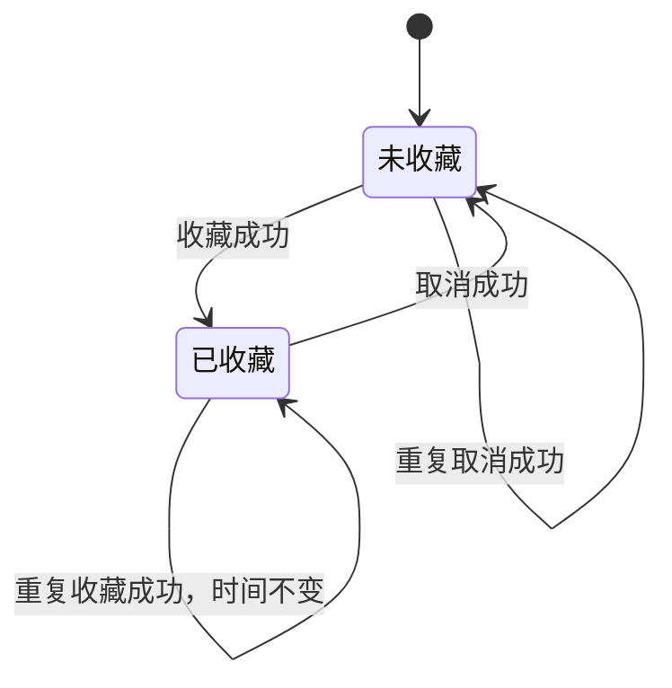
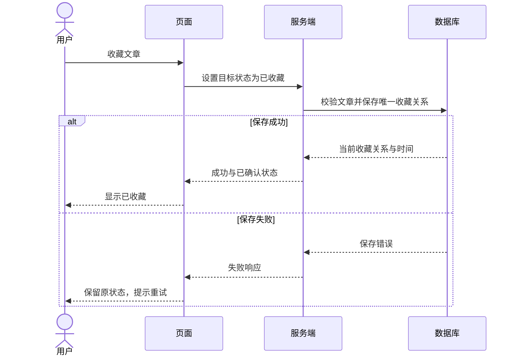

# 收藏功能案例：一次完整的共创

这是按需参考的完整案例。快速入门请查看[开始共创](README.md)中的简短对话，再用自己的想法进入五步流程。

原始想法是：“给知识库加个收藏功能，方便以后看。”本页演示怎样把这句话变成需求、业务规则、实现设计和验收案例。

> 本页全部问答、规则、字段与接口都是教学示例。示例中的“已确认”仅表示这段模拟对话内形成的约定，不代表本仓库已有功能或真实用户授权。代码和测试没有在此案例中执行。

[TOC]

## 对齐目标：确认文档用途

**用户的起始提示**

```text
给个人知识库增加收藏功能，方便以后查看文章。
请先和我澄清需求，最终形成供研发与测试使用的 Spec。
当前系统已经有文章列表；本期不做多用户。
```

**AI 应先识别的内容**

目标是再次找到感兴趣的文章；读者是研发和测试；当前已知范围是个人使用。仍需要明确：收藏是否跨浏览器保留，收藏列表从哪里进入，取消后的反馈是什么，原文章消失时怎样处理。

这时不宜直接生成完整接口与数据库设计，因为存储位置和核心行为尚未确定。

## 澄清需求：每轮确认一个关键问题

下表汇总了连续三轮对话。实际共创时每次只提出其中一个问题，回答后记录决定，再继续下一轮。

| AI 的问题 | 示例用户的选择 | 形成的约定 |
| --- | --- | --- |
| 收藏仅在当前浏览器保留，还是在其他浏览器也能查看？后者需要服务器保存 | 希望跨浏览器查看 | 收藏状态保存在服务器 |
| 取消收藏后，当前收藏列表立即移除，还是刷新后更新？ | 保存成功后立即移除 | 服务器确认后更新界面 |
| 本期是否需要分组、标签和批量操作？ | 先只做收藏、取消和收藏列表 | 分组、标签、批量操作不在范围内 |

AI 将答案写回任务说明，再处理下一组问题。示例用户继续确认：列表按收藏时间倒序；重复收藏不改变时间；取消后重新收藏采用新时间；文章被删除后同步删除收藏关系，不保存原文快照。

现在可以继续写作。跨浏览器查看是从服务器重新读取状态，本期不承诺跨窗口实时同步。示例限定单个界面按顺序发送修改，跨客户端并发冲突的更强一致性保证不在本期范围内。

## 确认结构：形成共识摘要和大纲

**共识摘要**

```text
目标：帮助个人用户再次找到已保存的文章。
范围：收藏、取消收藏、收藏列表、刷新或重新进入后的状态恢复。
非目标：多用户、分组、标签、批量操作、原文快照、跨窗口实时同步。
存储：服务器保存；同一文章最多一条收藏关系。
排序：收藏时间倒序；时间相同时按文章 ID 倒序。
重复操作：重复收藏保留原时间；重复取消按成功处理。
失败反馈：页面保留操作前已确认状态，并提示重试。
删除规则：文章删除时同步删除其收藏关系。
```

**用于写作的大纲**

| 章节 | 回答的问题 | 核心产物 |
| --- | --- | --- |
| 目标与范围 | 为什么做、承诺哪些行为？ | 目标、非目标和约束 |
| 场景与规则 | 各种操作发生后会怎样？ | 规则 R-01 至 R-07 |
| 实现设计 | 怎样落实已经确认的规则？ | 数据约束、接口、时序 |
| 验收与未决事项 | 怎样检查符合约定？ | AC 案例与检查边界 |

## 逐节共创：写出需求和业务规则

以下规则是本例的行为基准。后文设计与验收引用这些编号。

| 编号 | 规则 |
| --- | --- |
| R-01 | 文章存在时可以收藏；同一文章最多保留一条收藏关系 |
| R-02 | 保存成功后显示已收藏；刷新或重新进入时读取服务器状态 |
| R-03 | 取消成功后删除收藏关系，文章本身保留；在收藏列表中立即移除该项 |
| R-04 | 请求失败时页面保留原已确认状态，提供失败提示与重试入口 |
| R-05 | 重复收藏保留原时间；重复取消按成功处理；取消后重新收藏采用新时间 |
| R-06 | 收藏列表按收藏时间倒序，时间相同时按文章 ID 倒序 |
| R-07 | 文章删除时同步删除收藏关系；本期不保留原文快照 |

收藏列表为空时显示“还没有收藏的文章”，并提供返回全部文章列表的入口。读取列表失败时显示加载失败与重试入口，不能把失败伪装成空列表。



图 4：文章存在时的收藏业务状态。请求失败不改变原状态；重新收藏沿“未收藏 → 已收藏”路径记录新时间。文章删除由 R-07 单独约定，图中没有将“文章不存在”混为收藏状态。

## 逐节共创：补充与规则对应的实现设计

以下是供讨论的最小设计。实际接入项目时，还需先查明既有接口、数据库操作入口和迁移约定，再调整命名与代码位置。

**数据约定**：收藏关系包含文章 ID 与收藏时间。文章 ID 唯一，关联必须指向存在的文章。收藏成功后由服务器记录时间；重复收藏不能覆盖原时间。文章删除与收藏关系清理需要一致完成。

**接口建议**：使用设置目标状态的操作，让重试后的结果有明确含义。相同请求重复执行时，收藏状态不反转。响应字段应按实际项目的统一格式封装。

| 建议接口 | 业务结果 | 特殊情况 |
| --- | --- | --- |
| <code>PUT /api/favorites/<wbr>{article_id}</code> | 返回已收藏状态与收藏时间 | 文章不存在返回 404；已收藏保留原时间 |
| <code>DELETE /api/favorites/<wbr>{article_id}</code> | 返回未收藏状态 | 不存在收藏关系时仍按成功处理 |
| `GET /api/favorites` | 返回按 R-06 排序的收藏文章 | 空列表与读取失败分别表达 |

每篇文章的按钮在修改请求进行中暂停再次提交。收到成功响应才更新显示；失败时保留原状态并允许重试。若服务器已保存但响应丢失，重试相同目标状态应返回当前结果，不重复新增或反转状态。刷新也可重新读取服务器状态。



图 5：收藏操作的简化时序，强调“保存确认后更新界面”。文章不存在、读取列表失败和响应丢失的行为见正文，不在这张图中重复展开。

在真实实现文档中，若多个客户端可能同时修改状态，还需明确并发顺序和冲突策略。上述教学设计仅保证单个请求的目标状态语义，不能由此推断跨客户端实时一致。

## 审校定稿：把规则转成验收案例

验收用“前置条件、动作、预期结果”表达。下面列出代表性案例，重复操作、失败与边界同样需要覆盖。

| 编号与关联 | 前置条件及动作 | 预期结果 |
| --- | --- | --- |
| AC-01 / R-01、R-02 | 文章存在且未收藏，收藏后刷新 | 仅一条收藏关系，刷新后仍显示已收藏 |
| AC-02 / R-01、R-05 | 已收藏，再次发送收藏请求 | 关系数不变，收藏时间不变 |
| AC-03 / R-03 | 在收藏列表取消一篇已收藏文章 | 成功后移出当前列表，全部文章中仍存在 |
| AC-04 / R-05 | 没有收藏关系，重复发送取消请求 | 请求成功，保持未收藏 |
| AC-05 / R-04 | 保存请求失败 | 保留原已确认状态，显示失败并可重试 |
| AC-06 / R-05、R-06 | 取消后在较晚时间重新收藏 | 采用新时间，按新时间参与排序 |
| AC-07 / R-06 | 两篇收藏时间相同 | 按文章 ID 倒序，重复读取结果一致 |
| AC-08 / R-07 | 删除一篇已收藏文章，再读收藏列表 | 收藏关系被清理，列表不再出现该文章 |

另外检查：文章不存在时收藏返回 404；服务器已保存但响应丢失后重试不重复写入；空列表显示空状态；读取失败显示错误状态。这些案例补足接口与页面反馈的约定。

本表是验收设计，状态为“待执行”。实际测试报告还应记录测试环境、执行方式和结果，不能仅凭生成了表格便标记测试通过。

## 审校定稿：用反例审查草稿

**审校提示**

```text
请仅根据 Spec 解释首次收藏、重复收藏、取消后重加、保存失败、
文章删除和同时间排序的预期行为。
若一个案例存在两种合理解释，指出原文缺口及影响。
核对状态图、时序图、规则表、接口建议和验收案例是否一致。
不增加范围外功能，暂不重写全文。
```

例如，若早期草稿只写“按时间排序”，审校应指出：时间指文章发布时间还是收藏时间？升序还是降序？相同时间如何处理？经示例用户确认，才形成当前 R-06 和 AC-07。

又如，“请求失败保留原状态”需要说明是页面当前显示的已确认状态；服务器可能已经写入但响应丢失。接口重试与刷新读取的设计，正是为这个差异提供明确恢复方式。

## 后续修订：局部变更怎样保持一致

假设后续提出：“再次点击收藏可以把文章置顶。”这会与 R-05 的“重复收藏保留时间”冲突，也会改变重试的含义。

AI 应先给出影响分析：重复请求若更新时间，网络重试也可能导致排序变化。可讨论新增独立置顶或重新收藏操作，或者明确接受新的时间语义；不能直接改一句正文就继续沿用旧设计。

| 受影响产物 | 需要核对的内容 |
| --- | --- |
| 需求与规则 | 重复收藏的行为、排序依据、是否增加独立操作 |
| 状态与交互图 | 重复操作时是否更新数据、何时显示结果 |
| 数据与接口 | 时间字段含义、重试语义、目标状态约定 |
| 验收案例 | 重复请求、响应丢失重试、排序变化 |

这项新提议在本例中保持“待定”，原 R-05 继续作为当前规则。完成决定后，再同步所有受影响内容。

## 最终交接摘要

```text
文档状态：教学示例内的需求与设计草稿，未实施、未执行测试。
当前范围：个人收藏、取消、收藏列表、服务器持久化。
行为基准：R-01 至 R-07。
验证入口：AC-01 至 AC-08，以及正文列出的接口和页面边界案例。
未决提议：重复收藏是否具有置顶含义；当前仍沿用 R-05。
真实项目接入前：核对代码入口、数据约束、响应格式与并发使用方式。
下一步：由实际需求负责人确认规则，再进入项目既定实施流程。
```

这个案例展示的核心做法是：先确认行为，再引用这些行为设计接口和验证；新提议出现时，明确它与当前约定的关系。需要继续共创时，可以从这份摘要和当前文档恢复工作。

回到[开始共创](README.md)，用自己的任务启动共创；需要针对某一环节追加要求时，再查看 [Prompt 工具箱](prompts.md)。
