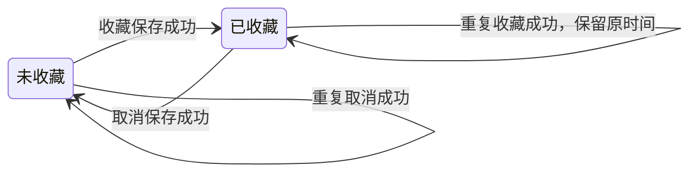
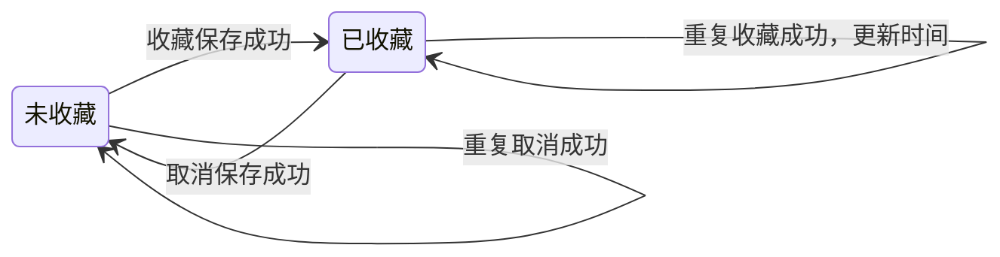

# 收藏功能案例：从全景到一次完整修订

原始想法：“给个人知识库加收藏功能，方便以后看。”下面演示如何先确认整体行为，再完善文档，以及修改一项规则后如何维护全文。

> 全部问答、规则、接口与数据均为教学示例。“已确认”仅指模拟对话内的约定，不代表本仓库现状或真实用户授权。所有验收案例均待执行。

## 1. 先对齐目标

AI 复述：帮助个人用户再次找到感兴趣的文章，最终形成供研发与测试使用的 Spec。先澄清收藏是否需要跨浏览器保留，因为答案会改变存储方案和使用方式。

示例用户选择：服务器保存，刷新或重新进入时读取状态。本期只做收藏、取消和收藏列表。

## 2. 展示完整全景

| 内容 | 初步全景 |
| --- | --- |
| 目标 | 再次找到已收藏文章 |
| 范围 | 个人收藏、取消、列表、状态恢复 |
| 主流程 | 选择文章 → 提交收藏 → 保存成功 → 更新按钮和列表 |
| 失败 | 确认保存失败时保留原状态；结果未知时重新读取 |
| 关键约束 | 同一文章最多一条收藏关系；取消不删除文章 |
| 验收 | 收藏后刷新仍保留，取消后文章仍存在，失败和未知结果可区分 |
| 待定 | 重复收藏是否更新时间，排序规则，文章删除后的处理 |

示例用户认可整体方向。非目标包括多用户、分组、标签、批量操作、原文快照和跨窗口实时同步；单个界面按顺序提交修改，本例不定义跨客户端并发冲突策略。

这里先确认完整逻辑，不急于生成数据库字段和接口文档。

## 3. 用场景作出决定

假设当前列表为 B（10:00）、A（09:00），11:00 再次收藏 A：

| 选择 | 可见结果 | 需要考虑什么 |
| --- | --- | --- |
| 保留原时间 | B 仍在 A 前面 | 顺序稳定，请求重试不改变时间 |
| 更新为当前时间 | A 移到 B 前面 | 新操作与同一操作的重试是否需要区分？ |

示例用户选择保留原时间，并继续确认：列表按收藏时间倒序，同时间按文章 ID 倒序；取消后重新收藏采用新时间；文章删除时同步清理收藏关系。

AI 将这些答案写入全景与规则表，再开始补充详细内容。

## 4. 完善完整基线 v0.1

本例 v0.1 是模拟用户已确认的行为与设计基线，未实施、未执行验收。后面的候选变化不会覆盖它。

**必要定义**：收藏关系表示一篇文章进入个人收藏清单，包含文章 ID 与收藏时间。收藏列表仅展示存在收藏关系的文章。取消收藏删除关系，文章本身保留。

| 编号 | v0.1 的已确认规则 |
| --- | --- |
| R-01 | 文章存在时可以收藏；同一文章最多一条收藏关系 |
| R-02 | 保存成功后更新按钮；刷新或重新进入时读取服务器状态 |
| R-03 | 取消成功后删除关系，在收藏列表移除该项；文章保留 |
| R-04 | 确认保存失败时保留原已确认状态，提示失败并提供重试入口 |
| R-05 | 重复收藏保留原时间；重复取消按成功处理；取消后重新收藏采用新时间 |
| R-06 | 按收藏时间倒序，时间相同按文章 ID 倒序 |
| R-07 | 文章删除时同步清理收藏关系，不保存原文快照 |
| R-08 | 请求结果未知时提示“结果待确认”，重新读取服务器状态；读取失败时保持待确认并提供重试读取入口 |
| R-09 | 空列表显示空状态与返回文章列表入口；读取失败显示错误与重试，不能显示为空列表 |


```mermaid
%%{init: {"state": {"useMaxWidth": false}}}%%
stateDiagram-v2
    direction LR
    state "未收藏" as U
    state "已收藏" as S
    U --> S: 收藏保存成功
    S --> U: 取消保存成功
    S --> S: 重复收藏成功，保留原时间
    U --> U: 重复取消成功
```

G-01：v0.1 的业务状态图，窄屏可在图内横向滚动。确认保存失败不改变业务状态；请求结果未知是页面的确认状态，不能由此推断服务器没有写入。文章删除由 R-07 约定。

<details>
<summary>展开 v0.1 的最小实现设计与验收计划</summary>
<p>以下设计均为本例拟议内容。真实项目接入前需要核实既有数据与接口约定。</p>
<p><strong>数据：</strong>收藏关系保存文章 ID 和服务器记录的收藏时间，文章 ID 唯一且必须指向存在的文章。重复收藏不覆盖时间；删除文章时一并清理关系。</p>
<p><strong>接口：</strong>设置目标状态，重复请求不反转状态。单个页面请求进行中暂停再次提交；收到成功响应才更新界面。响应丢失后先重新读取，也可重试相同目标状态。</p>
<div class="table-scroll"><table>
<thead><tr><th>设计位置</th><th>建议操作</th><th>结果与边界</th></tr></thead>
<tbody>
<tr><td>I-01</td><td>PUT /api/favorites/{article_id}</td><td>返回已收藏与收藏时间；已收藏保留时间，文章不存在返回 404</td></tr>
<tr><td>I-02</td><td>DELETE /api/favorites/{article_id}</td><td>返回未收藏；无关系时仍成功，文章保留</td></tr>
<tr><td>I-03</td><td>GET /api/favorites</td><td>按 R-06 返回列表，读取失败与空列表区分</td></tr>
</tbody></table></div>
<p>AC-01 至 AC-10 均为待执行计划。正常、失败与边界不能仅凭接口建议判为通过。</p>
<div class="table-scroll"><table>
<thead><tr><th>验收与关联</th><th>条件与操作</th><th>预期结果</th></tr></thead>
<tbody>
<tr><td>AC-01 / R-01、R-02</td><td>文章存在且未收藏，收藏后刷新</td><td>一条关系，刷新后仍已收藏</td></tr>
<tr><td>AC-02 / R-05、R-06</td><td>较晚时间再次收藏 A</td><td>关系数、时间和排序均不变</td></tr>
<tr><td>AC-03 / R-03</td><td>收藏列表取消文章</td><td>成功后移除该项，文章仍存在</td></tr>
<tr><td>AC-04 / R-05</td><td>重复取消</td><td>成功，保持无关系</td></tr>
<tr><td>AC-05 / R-04</td><td>服务器明确未保存并返回失败</td><td>保留原已确认状态，提示失败和重试</td></tr>
<tr><td>AC-06 / R-05、R-06</td><td>取消后较晚时间重新收藏</td><td>采用新时间并重新排序</td></tr>
<tr><td>AC-07 / R-06</td><td>两篇收藏时间相同</td><td>文章 ID 倒序</td></tr>
<tr><td>AC-08 / R-07</td><td>删除已收藏文章</td><td>关系清理，列表不再出现</td></tr>
<tr><td>AC-09 / R-05、R-08</td><td>保存成功但响应丢失，重读或重试</td><td>先显示待确认；成功读取或重试后恢复已收藏，原时间不变</td></tr>
<tr><td>AC-10 / R-01、R-09</td><td>分别构造不存在文章、空列表和读取失败</td><td>收藏不存在文章返回 404；空列表与读取失败显示不同状态和入口</td></tr>
</tbody></table></div>
</details>

**关联记录**：R-05 对应重复操作说明、收藏时间数据约定、I-01、G-01、AC-02、AC-06 和 AC-09。R-06 对应列表说明、I-03、AC-02、AC-06 和 AC-07。修改时还需全文核对语义，不能只检查记录里的位置。

## 5. 修改提议：再次收藏应置顶

模拟用户提出新想法后，AI 先记录为候选，不直接覆盖 v0.1。该变化会改变时间写入和排序，还可能让网络重试再次更新收藏时间。

**AI 的关键问题**：一次收藏已保存但响应丢失，重试时是否仍沿用第一次保存时间？

| 选项 | 影响 |
| --- | --- |
| A．每次收到请求都更新时间 | 机制简单，但网络重试也会改变排序 |
| B．新操作更新时间，同一操作重试保留时间 | 需要区分操作身份，保证重试得到相同结果 |

本例模拟用户明确选择 A：每次成功执行收藏请求都采用服务器当前时间，接受网络重试也会再次更新收藏时间。这是明确的业务取舍，不由 AI 擅自决定。选 B 则需要先澄清操作身份与重试约束，再增加相应设计。

## 6. 同步修订完整草稿 v0.2

| 受影响位置 | v0.2 的对应修订 |
| --- | --- |
| 全景与 R-05 | 重复收藏更新时间；重复取消和取消后重新收藏的规则不变 |
| 收藏时间约定与 I-01 | 每次成功执行收藏请求都写入服务器当前时间；收藏状态不反转，但不再承诺时间保持不变 |
| 排序说明与演示 | R-06 的排序依据不变；A 于 11:00 再次收藏后，A 排在 B 前面 |
| G-01 | 已收藏到已收藏的标签改为“重复收藏成功，更新时间” |
| AC-02 | 关系数不变、时间变为 11:00、A 排在 B 前面 |
| AC-09 | 保存成功但响应丢失后，11:01 重试成功，时间更新为 11:01，并按该时间排序 |
| 其他案例 | 核对重新收藏、失败、删除、同时间排序仍成立 |

原有 v0.1 保留为历史基线。下面的 v0.2 包含完整必要规则、设计与验收，不只列变化；真实共创时使用同一个当前文档入口，历史版本另行保留。

<details>
<summary>展开完整交付草稿 v0.2：规则、设计和验收</summary>
<p><strong>目标与范围：</strong>帮助个人用户再次找到已收藏文章。包含收藏、取消、收藏列表和刷新后的状态恢复。服务器保存状态，确认成功后更新界面。单个界面按顺序提交修改。</p>
<p><strong>非目标：</strong>多用户、分组、标签、批量操作、原文快照、跨窗口实时同步和跨客户端并发冲突策略。</p>
<p><strong>定义：</strong>收藏关系关联文章与个人收藏清单，保存文章 ID 和收藏时间。收藏列表只展示具有该关系的文章；取消收藏删除关系，不删除文章。</p>
<div class="table-scroll"><table>
<thead><tr><th>编号</th><th>v0.2 的已确认规则</th></tr></thead>
<tbody>
<tr><td>R-01</td><td>文章存在时可以收藏，同一文章最多一条收藏关系。</td></tr>
<tr><td>R-02</td><td>保存成功后更新按钮；刷新或重新进入时读取服务器状态。</td></tr>
<tr><td>R-03</td><td>取消成功后删除关系，收藏列表移除该项，文章保留。</td></tr>
<tr><td>R-04</td><td>确认保存失败时保留原已确认状态，提示失败并提供重试入口。</td></tr>
<tr><td>R-05</td><td>每次成功执行收藏请求都采用服务器当前时间，重复收藏与网络重试也更新时间；重复取消按成功处理，取消后重新收藏采用新时间。</td></tr>
<tr><td>R-06</td><td>列表按收藏时间倒序；时间相同按文章 ID 倒序。新请求时间与原时间相同时，仍按这个排序规则处理，不保证置顶。</td></tr>
<tr><td>R-07</td><td>文章删除时同步清理收藏关系，不保存原文快照。</td></tr>
<tr><td>R-08</td><td>结果未知时提示“结果待确认”，重新读取服务器状态；读取失败时保持待确认并提供重试读取入口。</td></tr>
<tr><td>R-09</td><td>空列表显示空状态和返回文章列表入口；读取失败显示错误与重试，不能显示为空列表。</td></tr>
</tbody></table></div>
<p><strong>数据约定：</strong>文章 ID 唯一，关系必须指向存在的文章。保存收藏关系时写入服务器当前时间，重复收藏覆盖原时间。文章删除与关系清理一并完成。</p>
<p><strong>页面约定：</strong>请求进行中暂停再次提交；成功后更新界面，明确失败时保留原状态，结果未知时重新读取。目标状态操作避免重复请求反转收藏状态，但时间和排序可能再次变化。</p>
<div class="table-scroll"><table>
<thead><tr><th>设计位置</th><th>建议操作</th><th>结果与边界</th></tr></thead>
<tbody>
<tr><td>I-01</td><td>PUT /api/favorites/{article_id}</td><td>返回已收藏与本次执行记录的时间；首次与重复收藏都写入当前时间，文章不存在返回 404</td></tr>
<tr><td>I-02</td><td>DELETE /api/favorites/{article_id}</td><td>返回未收藏，无关系时仍成功，文章保留</td></tr>
<tr><td>I-03</td><td>GET /api/favorites</td><td>按 R-06 返回列表，空列表与读取失败区分</td></tr>
</tbody></table></div>
<p><strong>验收计划：</strong>以下案例均待执行，使用可控制的服务器时间核对时间变化，不仅检查按钮。</p>
<div class="table-scroll"><table>
<thead><tr><th>验收与关联</th><th>条件与操作</th><th>预期结果</th></tr></thead>
<tbody>
<tr><td>AC-01 / R-01、R-02</td><td>文章存在且未收藏，收藏后刷新</td><td>一条关系，刷新后仍已收藏</td></tr>
<tr><td>AC-02 / R-05、R-06</td><td>B 为 10:00、A 为 09:00，于 11:00 再次收藏 A</td><td>关系数不变，A 时间变为 11:00，A 在 B 前面</td></tr>
<tr><td>AC-03 / R-03</td><td>收藏列表取消文章</td><td>成功后移除该项，文章仍存在</td></tr>
<tr><td>AC-04 / R-05</td><td>重复取消</td><td>成功，保持无关系</td></tr>
<tr><td>AC-05 / R-04</td><td>服务器明确未保存并返回失败</td><td>保留原已确认状态，提示失败和重试</td></tr>
<tr><td>AC-06 / R-05、R-06</td><td>取消后较晚时间重新收藏</td><td>采用新时间并重新排序</td></tr>
<tr><td>AC-07 / R-06</td><td>收藏时间相同，或重复收藏的新时间与原时间相同</td><td>仍按文章 ID 倒序，不保证该文章置顶</td></tr>
<tr><td>AC-08 / R-07</td><td>删除已收藏文章</td><td>关系清理，列表不再出现</td></tr>
<tr><td>AC-09 / R-05、R-08</td><td>A 在 11:00 保存但响应丢失，11:01 重试成功</td><td>未知时提示待确认；成功后 A 时间为 11:01，仅一条关系，并按新时间排序</td></tr>
<tr><td>AC-10 / R-01、R-09</td><td>分别构造不存在文章、空列表和读取失败</td><td>收藏不存在文章返回 404；空列表与读取失败显示不同状态和入口</td></tr>
</tbody></table></div>
<p>完整草稿的状态图 G-01 如下。真实项目中的接口命名和响应封装需要按项目现状适配，不改变上述已确认行为。</p>
</details>


```mermaid
%%{init: {"state": {"useMaxWidth": false}}}%%
stateDiagram-v2
    direction LR
    state "未收藏" as U
    state "已收藏" as S
    U --> S: 收藏保存成功
    S --> U: 取消保存成功
    S --> S: 重复收藏成功，更新时间
    U --> U: 重复取消成功
```

G-01（当前 v0.2）：窄屏可在图内横向滚动。沿用同一组业务状态和版式，仅修改重复收藏行为。网络重试成功也更新时间；结果未知时的页面行为与文章删除由正文规则约定。

## 7. 核对后形成新基线

AI 核对全景、R-05、数据约定、I-01、G-01、排序示例及 AC-02、AC-07、AC-09，确认当前草稿不再承诺重复收藏保留原时间。历史 v0.1 的旧规则清楚标注，不作为当前实施依据。

审校还发现“再次收藏应置顶”并非任何情况下都成立：时间相同时还要按文章 ID 排序。模拟用户明确接受按时间排序的结果，R-06 与 AC-07 已补充这个边界；如果必须无条件置顶，则需要返回全景重新讨论。

<details>
<summary>示例修订记录：怎样报告实际检查</summary>
<ul>
<li>方向：接受重复请求更新时间；“置顶”改为按新时间排序，时间相同仍按文章 ID。</li>
<li>正文与设计：完整 v0.2 已展开定义、R-01 至 R-09、数据和 I-01 至 I-03；R-05、R-06 与时间写入已同步。</li>
<li>图示与验收：G-01 修改重复操作标签，AC-02、AC-07、AC-09 改为对应预期。</li>
<li>保留内容：取消、失败、删除、空列表行为不变，已核对相应案例。</li>
<li>展示：标题、表格、图注沿用既有约定；发布时仍需实际渲染核对。</li>
<li>实施测试：全部待执行，本案例没有运行接口或数据库测试。</li>
</ul>
</details>

```text
交接：当前完整草稿 v0.2；历史基线 v0.1。
确认范围：个人收藏、取消、列表、服务器持久化。
当前规则：R-01 至 R-09；当前设计：I-01 至 I-03；图示：G-01（v0.2）。
关键变化：重复收藏与网络重试成功均更新时间，排序仍按 R-06。
验收：AC-01 至 AC-10，全部待执行。
下一步：核实实际项目接入位置与响应格式，再实施并执行验收。
```

回到[开始共创](README.md)启动任务，或使用[修订提示词](prompts.md)维护自己的完整 Spec。
