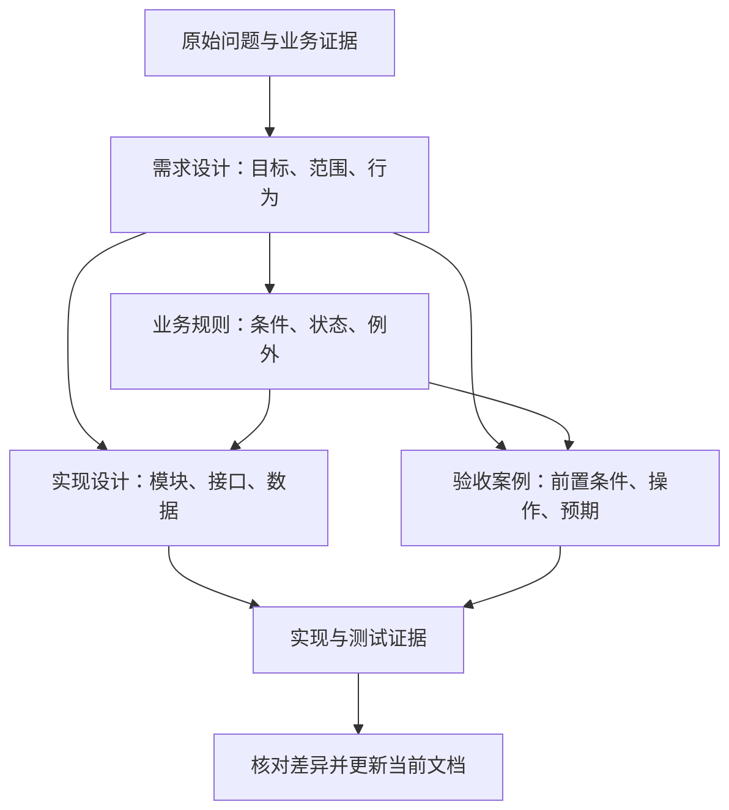

# 场景指南：共同流程，不同关注点

这是按需参考。先从[开始共创](README.md)进入五步流程，AI 会帮助选择文档类型；需要核对具体结构时再查看本页。

需求设计帮助团队决定做什么；实现设计说明怎样满足已经确认的要求；业务逻辑说明解释对象、规则与状态如何共同决定结果。三者可以相互引用，但各自需要回答的问题不同。

以下结构与 Prompt 是本指南的实践模板。使用时删去与任务无关的部分，补入真实材料，保留会影响本次决策的信息。

[TOC]

## 场景一：需求设计文档

**适用任务**：从原始想法、访谈记录或业务问题出发，明确功能的目标、范围、行为和验收方式。

需要准备目标使用者、现有问题的证据、典型使用场景、已知约束和已有产品行为。先确认“要解决什么问题”，再讨论“需要什么功能”。用户提出的解决方式也可以作为待比较选项，例如“增加一个收藏按钮”背后的目标可能是稍后阅读或快速找回。

**最小结构**

```text
1. 背景与问题：谁在什么情境下遇到什么困难
2. 目标与成功标准：本次改善什么，怎样观察效果
3. 范围与非目标：本期包含什么、明确不做什么
4. 场景与行为：触发、操作、结果、异常和边界
5. 业务规则与约束：跨场景共用的规则
6. 验收条件与待定问题：如何检查，什么仍需确认
```

**提问重点**：哪些用户和情境最重要？目标与功能是什么关系？哪些是本期承诺？失败后用户看到什么？怎样判定需求满足？对于业务效果指标，还需确认数据来源、基线和观察窗口。

```text
请根据 {材料} 共创需求设计文档，目标读者是 {读者}。
先识别用户问题、场景、目标、范围与非目标，再整理可观察的行为。
每项核心需求写明触发条件、预期结果、异常与验收方式。
遇到会改变范围或核心规则的缺口，先给出问题与选项。
技术实现建议单独列出，不替代尚未明确的业务要求。
本轮只输出 {澄清清单 / 大纲 / 指定章节}。
```

**合格标准**：不同实施者可以根据需求得出一致的用户行为；验收者能构造具体案例；未定义的关键事项显式列出。不要在没有依据时把目标写成虚构的增长率或性能数字。

适合使用用户流程图、用户旅程图和需求与验收对应表。旅程图适合表达使用过程中的目标与障碍；如果只是描述几个操作步骤，流程图更直接。

## 场景二：实现设计文档

**适用任务**：已有较清楚的行为要求，需要评估并约定技术方案、接口、数据、模块职责和验证方法。

需要准备已确认需求、相关代码与架构说明、现有接口和数据约束、依赖条件。材料中没有的模块、函数或表结构应标为拟议内容。读过代码可以说明设计依据，不能据此宣称测试已经通过。

**最小结构**

```text
1. 需求依据与技术目标
2. 当前结构、相关入口与约束
3. 候选方案、取舍与选定方案
4. 模块职责、调用过程与接口契约
5. 数据结构、状态、失败处理与兼容性
6. 实施顺序、验证方案与必要的发布回退安排
7. 风险、未决事项与证据来源
```

方案取舍只讨论真实可行且有差异的选项。对简单问题，一个沿用现有模式的方案和简短理由就足够。涉及持久化、重试或并发时，说明哪些结果必须保证，以及机制怎样满足要求。

```text
请依据已确认需求 {需求引用} 和当前代码材料 {材料} 设计实现方案。
先概括可核实的现状与必须遵守的约束，再提出最小可行改动。
说明每项改动对应哪条需求，定义接口输入输出、状态与错误行为。
只比较实际可行且影响明显的方案；新组件或新依赖需要说明必要性。
对代码事实注明来源，对拟议结构标记“设计建议”。
给出验证计划；未执行的测试不能记为通过。
```

**合格标准**：每个主要设计选择都能追溯到需求或约束；模块和接口边界清楚；重复请求、失败和兼容性按实际需要被处理；验证计划覆盖关键行为。发布或迁移安排仅在本次变更确有需要时加入。

适合使用模块架构图、交互时序图和数据字典。架构图说明谁负责什么，时序图说明请求如何经过这些边界，数据字典补充图里放不下的字段约束。

## 场景三：业务逻辑梳理文档

**适用任务**：规则散落在业务人员口述、流程文件、代码条件和历史需求里，需要整理为能解释具体结果的规则体系。

先确认是在描述现状，还是设计未来规则。准备业务术语、对象与状态、代表性案例、条件来源和例外记录。实现中的一个分支可能是技术补丁，不能自动推断为业务方认可的政策。

**最小结构**

```text
1. 业务范围、术语与参与者
2. 业务对象、关键字段与状态定义
3. 事件与主流程
4. 条件、动作、优先级及例外规则
5. 状态变化与始终成立的约束
6. 正常、异常、边界案例
7. 来源、冲突与未决事项
```

**提问重点**：什么事件触发规则？哪些条件决定结果？多条规则同时命中时谁优先？没有规则命中时如何处理？哪些状态变化不允许？业务条件变化后是否重新计算？

```text
请依据 {材料} 梳理 {业务范围} 的业务逻辑，文档用于 {用途}。
先统一术语、对象与状态，再按“事件、条件、动作、结果、例外”提取规则。
为每条规则注明来源，区分已确认政策、代码现状和待确认推断。
检查规则冲突、条件遗漏、优先级不清和不合法状态变化。
用决策表与状态图表达关键规则，并提供能验证这些规则的案例。
无法确定的业务含义先列问题，不自行补全政策。
```

**合格标准**：给定一个具体案例，读者能从规则中确定结果；规则没有隐含优先级；未覆盖条件有明确处理；状态图与规则表相符。

以下决策表使用收藏功能作为教学示例。它只描述服务器成功处理后的业务结果，失败时保持原状态；跨设备并发、异步乱序等行为不在此简化表中定义。

| 当前是否收藏 | 请求的目标状态 | 成功处理后的结果 |
| --- | --- | --- |
| 否 | 已收藏 | 建立关系，记录本次收藏时间 |
| 是 | 已收藏 | 保留原关系与时间 |
| 是 | 未收藏 | 删除关系，文章保留 |
| 否 | 未收藏 | 保持无收藏关系，按成功处理 |

决策表很适合揭示“重复取消”之类容易漏掉的组合。如果条件过多，应按业务子问题拆分；不能靠删掉不方便的组合来缩小表格。

## 场景四：说明已有实现

已有系统说明与实施前设计共享部分结构，但证据要求不同。写作时把“当前实现”“测试已验证”“设计意图”“待核实”分开。

```text
请根据 {指定代码、测试与运行材料} 说明当前实现。
先给出入口和主要调用关系，再解释数据变化与异常处理。
关键结论注明文件、函数或测试案例来源。
代码中未找到的行为标为待核实；不要把规划文档写成已实现事实。
本轮只读和编写说明，不修改业务代码。
```

如果当前代码与既有规范冲突，分别写出双方行为及影响，再交给负责人员确认修复或调整规范。不能为了让文档自洽而悄悄抹去差异。

## 同一需求如何连接三份文档



图 3：文档之间通过同一套行为约定连接。实际工作可以交替完善需求和规则；图中箭头表示内容依赖，不要求机械地逐份写完才继续。

例如，需求 R-02 约定“刷新后收藏仍保留”；实现设计引用 R-02，说明服务器存储与读取方式；验收 AC-02 引用 R-02，验证刷新后的状态。用编号建立对应关系，比在三处各自重写一遍规则更容易维护。

## 快速选择表

| 你需要解决的问题 | 主要产物 | 优先检查 |
| --- | --- | --- |
| 做什么、范围是什么 | 需求设计 | 场景与行为可验收 |
| 采用什么方案、如何实现 | 实现设计 | 方案符合需求和现有约束 |
| 条件和状态如何决定结果 | 业务逻辑说明 | 冲突、遗漏与例外 |
| 系统现在实际怎样工作 | 已有实现说明 | 代码与验证证据 |

回到[开始共创](README.md)继续实际任务；需要完整演示时，可查看[收藏功能案例](example.md)。
