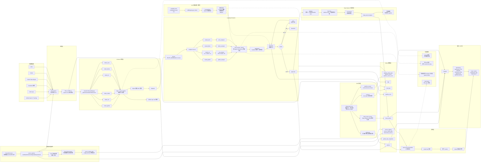

# 项目架构图

```mermaid
flowchart LR
    subgraph Sources["外部数据源"]
        GH["GitHub Search / Trending"]
        RSS["RSS Feed"]
        Hot["NewsNow 热榜"]
        HN["Hacker News Algolia"]
        Feishu["Feishu"]
        Arxiv["arXiv"]
    end

    subgraph Schedule["调度层"]
        Cron["APScheduler\n北京时间 Cron"]
        Queue["同 cron 合并 run\nasyncio.Lock 串行排队"]
    end

    subgraph Collect["Collector 采集层"]
        CMap["COLLECTOR_MAP[type]\ngithub/rss/hotlist/hn/feishu/arxiv"]
        CGH["collect_github"]
        CRSS["collect_rss"]
        CHot["collect_hotlist"]
        CHN["collect_hn"]
        CFeishu["collect_feishu"]
        CArxiv["collect_arxiv"]
        Fetch["httpx + asyncio.gather\n按源并行采集"]
        Dedupe["SQLite 批量 URL 查重"]
        Snapshot["GitHub repo star 快照"]
        Raw["RawItem"]
    end

    subgraph Graph["LangGraph Pipeline"]
        Router["Router\nROUTE_MAP[RawItem.source]"]
        Fanout["Analyzer fan-out"]
        RG["routed_github"]
        RR["routed_rss\nrss + hotlist + hn"]
        RF["routed_feishu"]
        RA["routed_arxiv"]
        GithubA["github_analyzer"]
        RssA["rss_analyzer\nRSS / hotlist / HN"]
        FeishuA["feishu_analyzer"]
        ArxivA["arxiv_analyzer"]
        Base["base.analyze_items()\n按 Agent concurrency 有限并发"]
        Agg["Aggregator\nPydantic 校验 + 成本统计"]
        Review["Reviewer\n四维评分"]
        Verdict{"verdict"}
        Retry["retry\n最多 2 轮"]
        Drop["discarded"]
        Approved["approved"]
    end

    subgraph LLM["LLM 基础设施（横切）"]
        Config["config/llm.yaml\nconfig/agents.yaml\n.env"]
        Registry["LLMRegistry.get_client()"]
        Tracked["TrackedClient\nOpenAI 兼容协议"]
        Guard["成本记账\nProvider 熔断\n预算熔断\nfallback"]
    end

    subgraph Governance["数据源治理闭环"]
        Discovery["SourceDiscovery\n发现候选 GitHub/RSS 源"]
        SourceReg["source_registry\ncandidate/trial/active/degraded/quarantined"]
        Trial["trial 小流量试跑\n最多 3 条"]
        Gov["SourceGovernance\n每日健康分与状态迁移"]
        HealthDaily["source_health_daily\nbudget_blocked 单独记录"]
    end

    subgraph DBAccess["DB 访问层"]
        Ops["db/operations.py\n兼容入口 + 统计/备份/source health"]
        ArticleOps["articles.py\n文章/标签/查重/搜索/详情"]
        PipelineOps["pipeline_ops.py\nrun/event/source funnel"]
        CostOps["costs.py\ncost_logs 与当日花费"]
        DeepOps["deep_report_ops.py\nDeep Reports CRUD/版本切换"]
    end

    subgraph DB["SQLite 数据层"]
        Articles["articles"]
        Tags["tags"]
        Costs["cost_logs"]
        Runs["pipeline_runs"]
        Obs["pipeline_phase_logs\npipeline_events\npipeline_source_runs"]
        SourceTables["source_registry\nsource_health_daily\ndiscovered_sources"]
        Snaps["github_repo_snapshots"]
        Reports["deep_reports"]
    end

    subgraph Failure["失败路径"]
        SourceFail["source 超时\n不中断其它源"]
        AnalyzeFail["单 item 失败\n记录 events/cost_logs"]
        AllAnalyzeFail["有新条目但 Analyzer 全失败\npipeline failed"]
        BuildFail["build failed\n旧 output 保留"]
    end

    subgraph Deep["Deep Reports 后置阶段"]
        Selector["selector\n最多 1 个高价值 GitHub repo"]
        Inspect["inspector\nshallow clone + 受限源码扫描"]
        Summary["summarizer\n压缩证据包"]
        DeepA["deep_report analyzer"]
        Isolated["失败隔离\n不影响主 pipeline"]
    end

    subgraph Publish["发布层"]
        Builder["Debounced Site Builder\n5 分钟去抖"]
        Tmp["output.tmp 渲染"]
        Rename["原子 rename"]
        Output["output/ 静态站产物"]
    end

    subgraph API["展示 / API 层"]
        FastAPI["FastAPI"]
        ApiRoutes["/api/articles\n/api/search FTS5\n/api/stats\n/api/pipeline/dag\n/api/sources\n/api/deep-reports"]
        Pages["index / article\ndashboard / dag\ndeep report"]
    end

    GH --> Cron
    RSS --> Cron
    Hot --> Cron
    HN --> Cron
    Feishu --> Cron
    Arxiv --> Cron
    Cron --> Queue --> CMap
    Discovery --> SourceReg
    SourceReg --> Trial
    Trial --> Gov
    Gov --> SourceReg
    Gov --> HealthDaily
    SourceReg --> Cron
    CMap --> CGH
    CMap --> CRSS
    CMap --> CHot
    CMap --> CHN
    CMap --> CFeishu
    CMap --> CArxiv
    CGH --> Fetch
    CRSS --> Fetch
    CHot --> Fetch
    CHN --> Fetch
    CFeishu --> Fetch
    CArxiv --> Fetch
    Fetch --> Snapshot
    Fetch --> Dedupe --> Raw --> Router

    Router --> Fanout
    Fanout --> RG --> GithubA
    Fanout --> RR --> RssA
    Fanout --> RF --> FeishuA
    Fanout --> RA --> ArxivA
    GithubA --> Base
    RssA --> Base
    FeishuA --> Base
    ArxivA --> Base
    Base --> Agg --> Review --> Verdict
    Verdict -->|50-79| Retry --> Review
    Verdict -->|<50| Drop
    Verdict -->|>=80| Approved

    Config --> Registry --> Tracked --> Guard
    Guard -.-> Base
    Guard -.-> Review
    Guard -.-> DeepA

    Approved --> Articles
    Approved --> Tags
    Review --> Costs
    Queue --> Runs
    Graph --> Obs
    Snapshot --> Snaps
    SourceReg --> SourceTables
    HealthDaily --> SourceTables

    Ops --> ArticleOps --> Articles
    Ops --> PipelineOps --> Obs
    Ops --> CostOps --> Costs
    Ops --> DeepOps --> Reports

    Approved --> Selector --> Inspect --> Summary --> DeepA --> Reports
    DeepA --> Isolated

    Articles --> Builder
    Reports --> Builder
    Builder --> Tmp --> Rename --> Output

    Fetch -.-> SourceFail
    Base -.-> AnalyzeFail
    Base -.-> AllAnalyzeFail
    Builder -.-> BuildFail

    Articles --> FastAPI
    Reports --> FastAPI
    Obs --> FastAPI
    FastAPI --> ApiRoutes
    Output --> Pages
    ApiRoutes --> Pages
```
