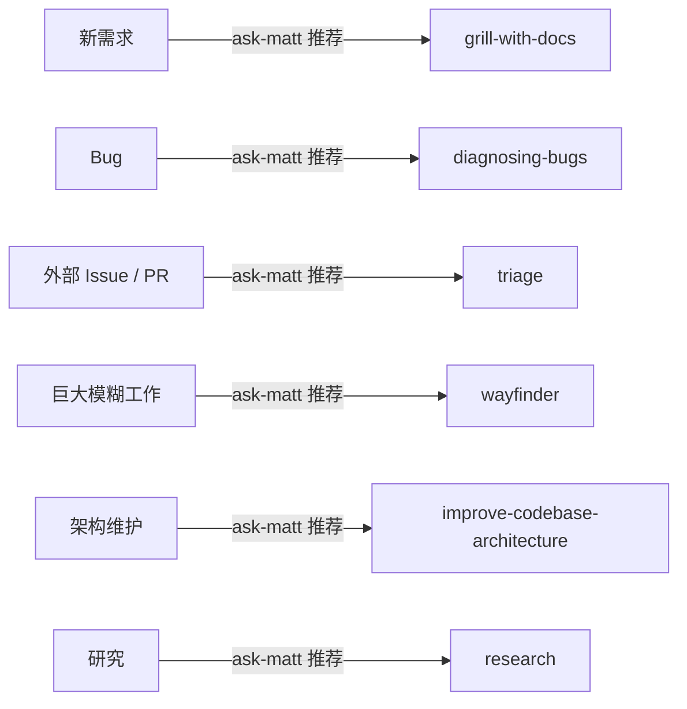
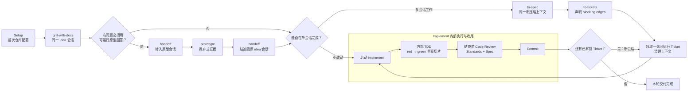
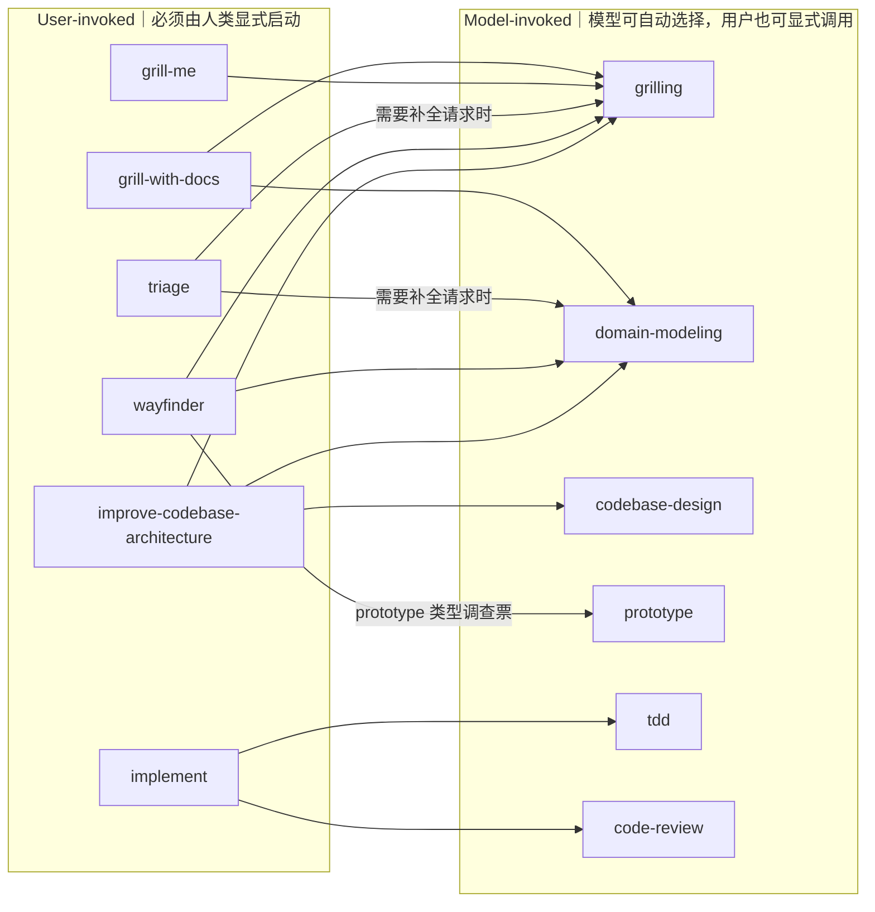
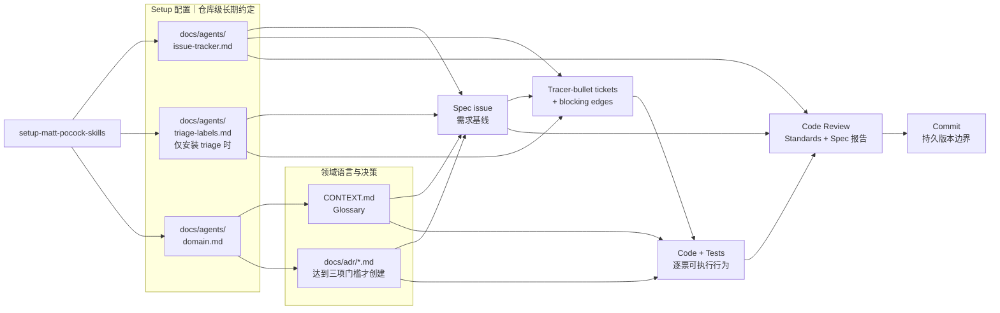
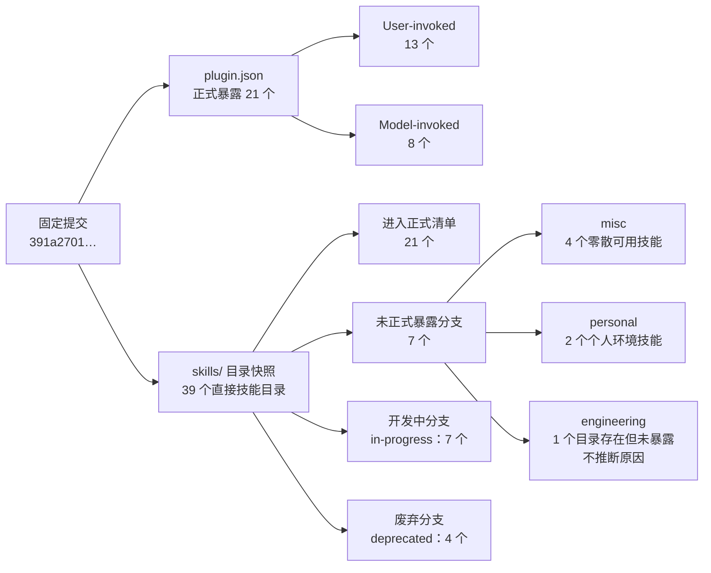

# mattpocock/skills 工作流与产物关系图

本文把 [`skills-analysis.md`](./skills-analysis.md) 的结论压缩为五张可独立阅读的关系图。所有数量与关系固定到 `mattpocock/skills` 提交 `391a2701dd948f94f56a39f7533f8eea9a859c87`；箭头表达推荐路线或实际组合关系，不表示一个 user-invoked 技能能自动调用另一个 user-invoked 技能。

## 1. 六类情境入口

`ask-matt` 根据当前工作情境推荐入口；它只负责给出路线，仍由用户显式启动下一项 user-invoked 技能。

路由按输入行一一对应：新需求进入澄清主链，Bug 先建立可执行反馈环，外部请求先分流，巨大工作先消除未知，架构维护先扫描候选，研究先产出带引用的事实材料。

## 2. Idea-to-ship 主流程

Setup 是仓库级首次前置。前期讨论、Spec 和 Tickets 尽量保留在同一未压缩上下文；进入实施后，每张 Ticket 都在干净上下文中重新启动一次 `implement`。

图中的 TDD 是 `implement` 内部反馈环，不是与 `implement` 平级的必经用户命令；`code-review` 也是其提交前的收尾门。二者仍可被单独调用。

## 3. User-invoked 与 Model-invoked 调用依赖

仅绘制固定源码中明确存在的组合边。左侧技能可编排右侧技能；图中没有画出的相邻主流程步骤（例如 `to-spec → to-tickets`）是用户下一步启动关系，不是自动调用依赖。

`ask-matt` 未作为调用源画入：它只推荐 user-invoked 路线，不能替用户启动这些路线。

## 4. 稳定产物交接

这张图展示多会话主链中的持久交接物。原型、研究和 handoff 是按需证据或跨上下文桥，不取代这些正式产物。

Spec 与 Tickets 只服务多会话工作；单会话小改可在 `grill-with-docs` 后直接实施，但仍应读取领域文档，并以 Tests、Review 和 Commit 收尾。

## 5. 正式暴露与目录状态分层

正式边界只由固定提交的 `plugin.json` 决定；目录桶是维护快照，不能用目录存在替代发布状态。

`engineering`、`productivity`、`misc`、`personal`、`in-progress`、`deprecated` 六桶合计 39 个目录；其中正式清单覆盖 21 个，其余 18 个分别处于未正式暴露、开发中或废弃分支。
