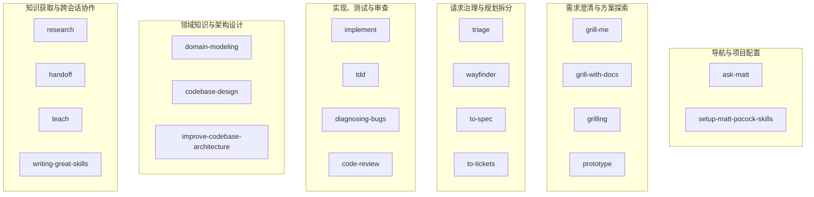
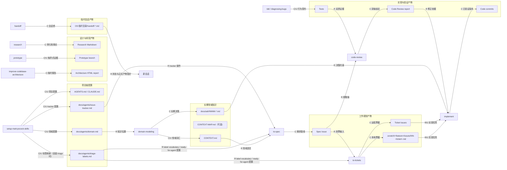
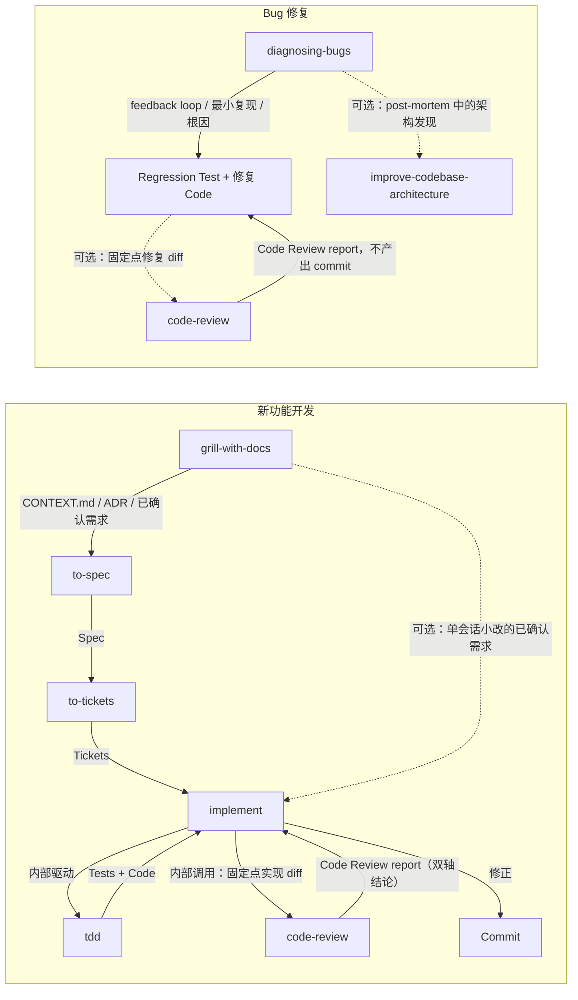
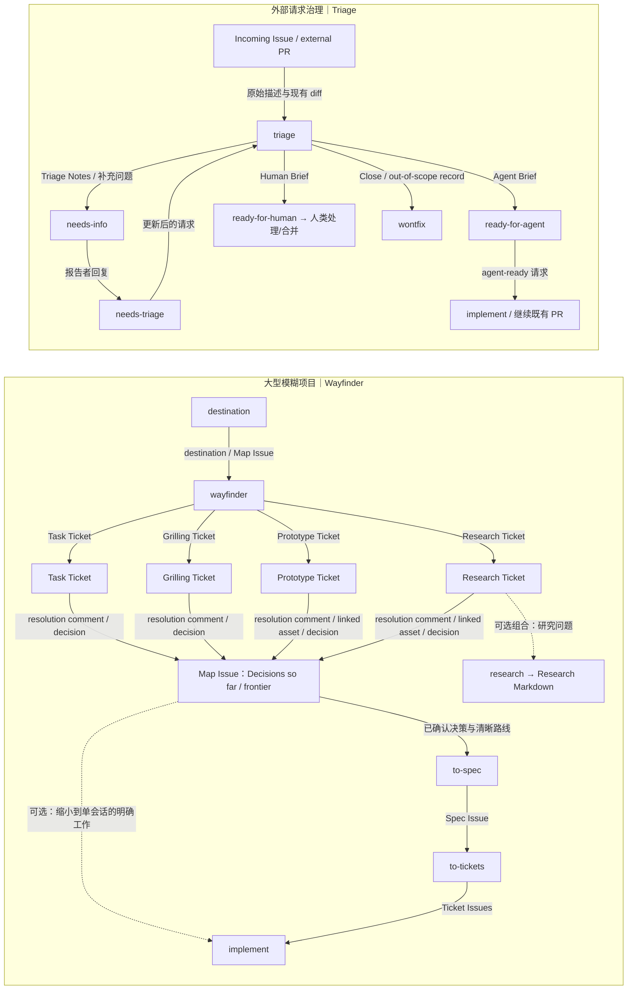
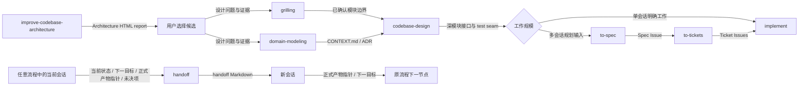

# mattpocock/skills 能力、产物与协作关系图

本文把 [`skills-analysis.md`](./skills-analysis.md) 中已经审定的六类能力、产物生命周期和五条协作流程压缩为五张关系图。所有名称与关系固定到 `mattpocock/skills` 提交 `391a2701dd948f94f56a39f7533f8eea9a859c87`；箭头表示产物交接，不表示相邻 Skill 会自动互相调用。

## 1. 六类能力地图

这张图回答“21 个正式 Skill 分别解决哪类问题”。六个分组是导航视图，不代表调用顺序或上游目录结构。

每个正式 Skill 在图中恰好出现一次，能力范围只帮助读者选择入口。调用方式是单项属性，未作为一级分类，也不应从节点相邻关系推断自动调用。

## 2. 产物生命周期与主要读写关系

这张图回答“协作依靠哪些持久或临时产物接续”。实线标签中的 `C/U/R` 分别表示创建、更新和读取；为保持可读性，只画正文矩阵中的主要生产与消费关系。

`CONTEXT-MAP.md` 没有固定创建者或更新者，因此只保留在生命周期分组中；它不是 Setup 自动生成物。Setup 仅在安装 `triage` 时创建 `triage-labels.md`，而 `to-spec`、`to-tickets` 声明需要这套 label vocabulary 和 `ready-for-agent` 配置；固定源码没有定义文件缺失时的回退。Research Markdown 与 Wayfinder Research Ticket 没有固定 C/U/R 关系，二者若组合只能作为可选路线。

## 3. 新功能开发与 Bug 修复

这张图并列展示两条交付路径：新功能先沉淀需求与规划，并由 `implement` 在内部驱动测试和审查；Bug 则由 `diagnosing-bugs` 自身完成反馈环、回归测试与修复，审查仅为可选质量门。所有实线边都以标签说明传递的产物。

虚线是按范围或诊断结果选择的组合：小改可跳过正式 Spec/Tickets；Bug 修复后可选择 `code-review`，缺少正确 test seam 时也可把架构发现交给架构维护。Bug 路径不串入 `tdd` 或 `implement`，且 `code-review` 只报告固定点 diff 的双轴结论，不创建 commit。

## 4. 大型项目与外部请求治理

这张图回答两类“尚不能直接实现”的工作如何被治理：Wayfinder 消散大型项目的未知，Triage 将外部请求分流到明确状态。实线表示票据、评论、brief 或状态记录的传递，虚线只表示分析建议中的可选组合。

Research Ticket 是 Wayfinder 的票据类型，图中没有把它画成对 `/research` 的固定调用；通往 `research` 的虚线明确是可选路线。Triage 处理外部原始 Issue/PR，`to-tickets` 生成的规划票据不再进入 Triage。

## 5. 架构维护与跨会话桥

这张图把架构维护的正式产物链与通用跨会话桥放在一起。架构链的实线标签写明报告、领域文档、模块设计和实现入口；handoff 只引用正式产物并传递状态，不取代任何业务流程。

Architecture HTML report 与 handoff Markdown 都位于 OS 临时目录，但生命周期职责不同：前者帮助用户选择架构候选，后者只做会话间桥接。新会话读取 handoff 中的正式产物指针和下一目标后，再从原流程的下一节点继续。跨会话时应引用 Spec、ADR、Issue、commit 或 diff 等事实源，而不是把它们复制进 handoff。
