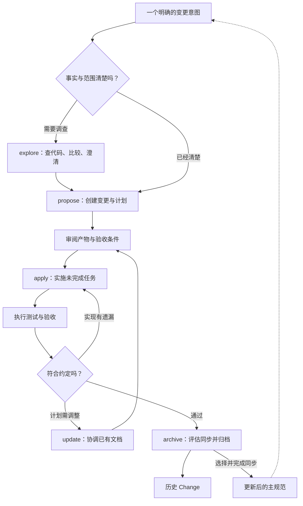
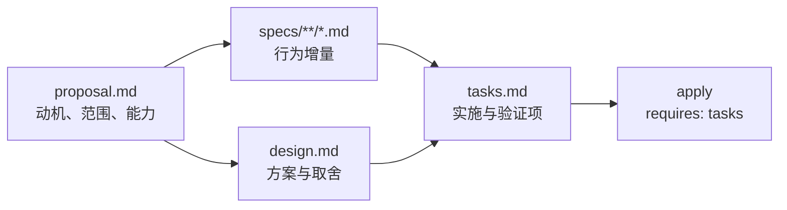
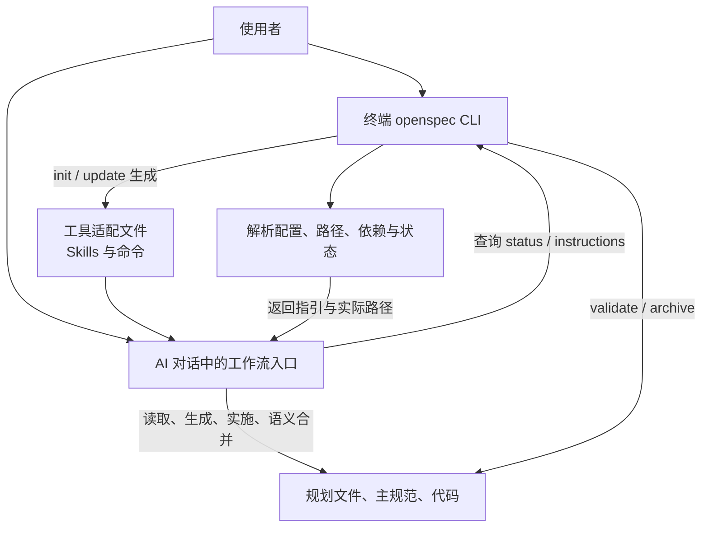
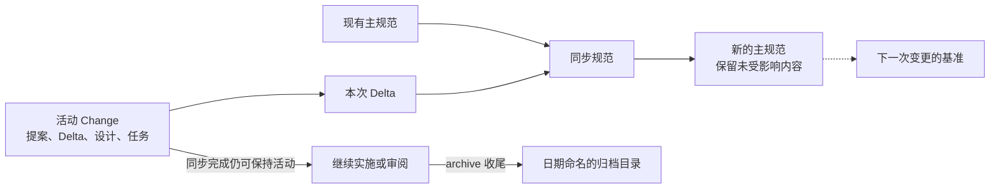
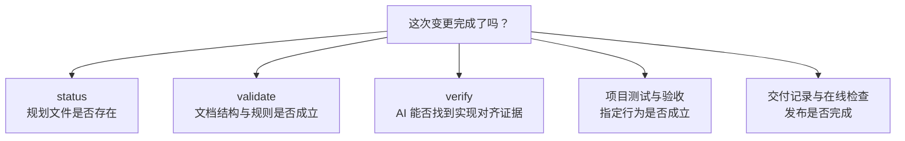
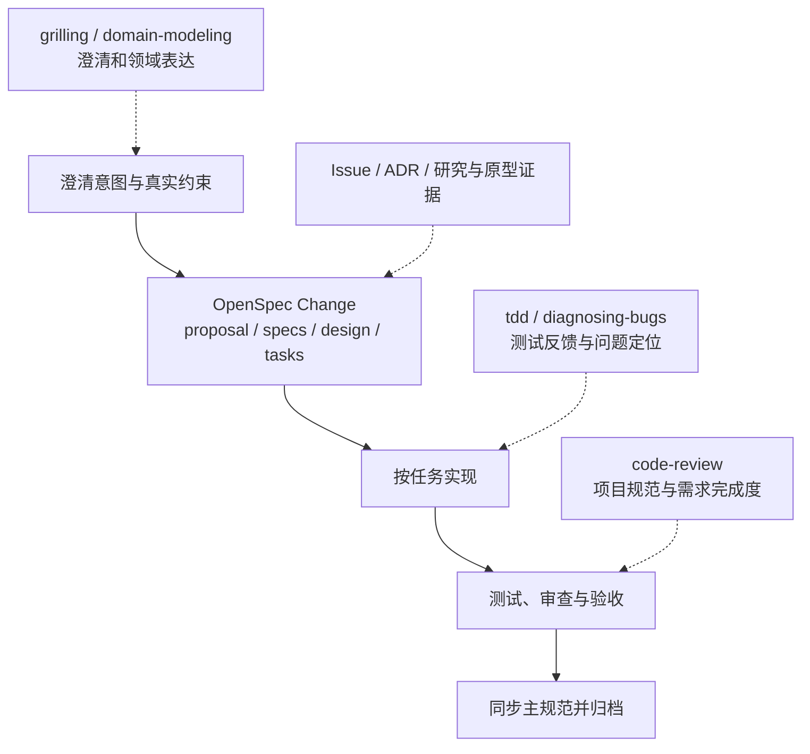

# 关系图：命令、文档与实现怎样连接

图中实线表示主要依赖或信息流，虚线表示可选协作。它们解释工作方式，不代表所有项目必须经过每个节点。依据固定到 v1.13.0 的[默认 Schema](https://github.com/Fission-AI/OpenSpec/blob/9d4e5974e5c0d9a09b9c6c1e1eb0975e80ec4461/schemas/spec-driven/schema.yaml)和[工作流清单](https://github.com/Fission-AI/OpenSpec/blob/9d4e5974e5c0d9a09b9c6c1e1eb0975e80ec4461/src/core/profiles.ts)。

## 1. 主生命周期

### 怎样读这张图？

propose 停在规划边界，审阅后才开始 apply；update 只改规划材料。archive 的同步分支有明确前提，不能把移动文件直接当作主规范更新完成。可选 verify 可以插在验收环节中，用来辅助检查实现对齐。

## 2. 默认产物依赖图

### 依赖不等于固定的线性阶段

默认 specs 和 design 都只直接依赖 proposal；tasks 依赖 specs 和 design。相同就绪层按 Schema 声明顺序推进。各文件仍可随着新认识调整，后面的变化也可以影响前面的内容。

design 的正文指引是条件性创建；当前 propose/ff 可以据此省略，状态系统却主要按文件存在与否计算。无行为变化的 Change 通过 `skip_specs: true` 正式跳过 specs。图展示默认定义中的边，不覆盖这些例外；实施前要结合动态指引与已记录的省略原因判断。

## 3. 两套命令，三个职责

### 哪一部分真正写代码？

apply 引导的是你正在使用的 AI 助手。CLI 负责提供结构和操作能力，并不是一个独立后台编码服务。终端 archive 与 AI archive 都能参与规范生命周期，但前者依结构化逻辑合并，后者遵循生成工作流进行语义判断。[命令机制](https://github.com/Fission-AI/OpenSpec/blob/9d4e5974e5c0d9a09b9c6c1e1eb0975e80ec4461/docs/how-commands-work.md)

## 4. 规范增量的去向

### 为何保留两份看起来相似的规范？

主规范回答“现在约定是什么”，归档中的 Delta 回答“那次改变了什么”。它们的时间角色不同，不是两个相互竞争的事实来源。未同步的活动 Delta 仍是提议，提前同步的内容则应明确其交付状态。

## 5. 五种证据分别回答什么？

### 为什么不用一根箭头串起来？

这些是不同的问题，不是一个“上一项通过就保证下一项”的链条。任务勾选可以错误，结构正确的 Spec 也可以描述错误目标；verify 需要事实证据，部署需要独立检查。图中后两类是工程验证职责，不属于新增 OpenSpec 工作流。[状态契约](https://github.com/Fission-AI/OpenSpec/blob/9d4e5974e5c0d9a09b9c6c1e1eb0975e80ec4461/docs/agent-contract.md)

## 6. 与 mattpocock Skills 的组合建议

### 这是一种配合建议，不是官方集成

先确定 OpenSpec 或 Tracker 中谁维护需求和进度，再把需要的工程方法用于相应环节。特别是 apply 与 mattpocock implement 都有实施编排职责，建议一次选择一个主执行入口，避免两个流程同时驱动同一任务。

规范、术语和 ADR 也应分工：行为写 Spec，词义写术语，跨变更的长期取舍写 ADR，文件之间引用即可。[mattpocock 使用手册](/analysis/mattpocock-skills/index.html)
