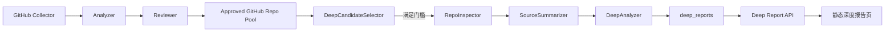
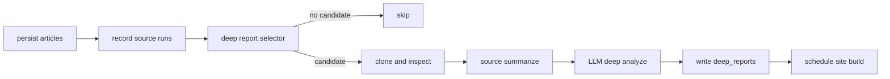

# 源码级深度分析模块设计

日期：2026-06-03

## 背景

当前系统已经能从 GitHub、RSS、arXiv 等来源采集 AI 资讯，并通过 Analyzer + Reviewer 生成普通文章。GitHub repo 目前会经过 repo-aware reviewer，能判断项目是否与 AI 工具、Agent、代码理解、RAG、MCP 等方向相关。

新的深度分析模块用于从高价值 GitHub AI 工具项目中自动挑选一个最值得研究的 repo，生成源码级研究报告。它不追求每天固定产出；只有候选项目满足门槛时才生成。

## 目标

- 自动从 GitHub AI 工具候选池中挑选最值得深挖的 repo。
- 临时 clone 仓库，做源码级结构扫描和关键路径分析。
- 生成带证据来源的深度报告，覆盖项目概述、技术栈、架构、核心模块、数据模型、数据流、应用场景、上手路径和二次开发建议。
- 深度分析失败不影响主 pipeline。
- 报告可通过 API 和静态页面查看，并能被后续仪表盘/数据源健康/成本统计追踪。

## 非目标

- 不做全仓库逐行审计。
- 不做安全审计、性能 benchmark、许可证合规审计。
- 不运行第三方项目代码。
- 不做大型 monorepo 的完整源码级分析。
- 不在第一版实现多版本 diff 或报告版本对比。

## 总体方案

采用独立 `deep_reports` 模块。它是 reviewer 之后的后置阶段，不替代现有文章入库流程。



## 触发策略

深度报告按条件触发，不按日强制产出。

触发条件：

- 候选必须是 GitHub repo。
- 候选来自本轮 pipeline 的 reviewed/analyzed/raw items。
- repo 方向属于 AI 工具、Agent、代码理解、RAG、MCP、开发者工具、知识库、自动化工具等实用方向。
- reviewer 结果为 `approved`，或接近通过但 repo 实用性特征强。
- 同一 repo 近 7 天内未生成过深度报告。
- 每次 pipeline 最多生成 1 篇深度报告。
- clone、扫描、LLM 分析任一步失败时写入失败状态，不阻断主 pipeline。

候选来源优先级：

1. `github_ai_devtools`
2. `github_trending_velocity`
3. `github_trending_hot`
4. 其他 GitHub source

候选排序使用 `deep_candidate_score`：

| 维度 | 权重 | 说明 |
|------|------|------|
| 实用性 | 45% | 是否能直接试用、解决真实开发或知识工作问题 |
| 工程学习价值 | 30% | 架构是否清楚、源码是否值得拆解学习 |
| Reviewer 分数 | 15% | 复用现有四维评分结果 |
| 热度/增速 | 10% | stars、forks、近期增速仅作为加分项 |

## 组件设计

### DeepCandidateSelector

职责：

- 从本轮 GitHub repo 中筛候选。
- 读取 `ReviewedItem`、`AnalyzedItem`、`RawItem` 和 GitHub metadata。
- 根据 source、reviewer verdict、评分、repo metadata 和近期报告记录计算候选分。
- 返回最多 1 个候选。

边界：

- 不 clone 仓库。
- 不调用 LLM。
- 不写报告正文。

### RepoInspector

职责：

- 临时 clone repo 到本地缓存或临时目录。
- 读取当前 commit SHA。
- 扫描 README、manifest、目录树、入口文件、核心目录和关键源码候选。
- 过滤无关或高风险内容。

默认限制：

- clone 超时：60 秒。
- 扫描源码文件上限：300 个。
- 单文件读取上限：80 KB。
- 关键文件抽取：8-15 个。
- 跳过目录：`.git`、`node_modules`、`dist`、`build`、`vendor`、`.venv`、`coverage`、`__pycache__`。
- 跳过二进制、大文件、锁文件和生成产物。

RepoInspector 只读取文件，不执行项目代码。

### SourceSummarizer

职责：

- 用确定性规则把源码扫描结果压缩成 LLM 可消费的结构化源码包。
- 识别技术栈、入口文件、核心模块、数据模型线索、API/CLI/配置线索。
- 为关键判断准备 evidence。

重点识别文件：

- `README*`
- `package.json`
- `pyproject.toml`
- `requirements.txt`
- `go.mod`
- `Cargo.toml`
- `Dockerfile`
- `docker-compose.yml`
- `src/**`
- `app/**`
- `packages/**`
- `models/**`
- `schema/**`
- `db/**`
- `store/**`
- `graph/**`
- `agent/**`
- `index/**`

### DeepAnalyzer

职责：

- 调用 LLM 生成结构化深度报告。
- 输出 JSON 和 Markdown。
- 对关键判断绑定 evidence。
- 记录成本和 token。

输出结构：

- `project_overview`
- `practical_value`
- `tech_stack`
- `architecture`
- `core_modules`
- `data_model`
- `data_flow`
- `use_cases`
- `setup_path`
- `extension_points`
- `risks`
- `recommendation`
- `evidence`

### DeepReportWriter

职责：

- 写入 `deep_reports`。
- 把报告状态、成本、token、触发原因、commit SHA、evidence 一起保存。
- 触发静态站构建。
- 写入 `pipeline_events`，让 DAG 能看到 deep report 阶段进度。

## 数据模型

新增 `deep_reports` 表：

| 字段 | 类型 | 说明 |
|------|------|------|
| id | INTEGER PK | 报告 id |
| repo_url | TEXT | GitHub repo URL |
| repo_name | TEXT | owner/name |
| article_id | INTEGER NULL | 对应普通文章 id |
| run_id | TEXT | 触发报告的 pipeline run |
| commit_sha | TEXT | 分析时的 commit |
| status | TEXT | pending/running/completed/failed/skipped |
| candidate_score | INTEGER | 候选评分 |
| trigger_reason | TEXT | 触发原因 |
| report_json | TEXT | 结构化报告 JSON |
| report_markdown | TEXT | 渲染用 Markdown |
| evidence_json | TEXT | 文件路径和证据摘要 |
| tech_stack_json | TEXT | 技术栈结构化数据 |
| file_tree_summary | TEXT | 目录树摘要 |
| analysis_cost | REAL | 深度分析总成本 |
| analysis_tokens | INTEGER | 深度分析 token |
| error | TEXT | 失败原因 |
| created_at | TEXT | 北京时间 |
| updated_at | TEXT | 北京时间 |

约束：

- `UNIQUE(repo_url, commit_sha)` 防止同一 commit 重复报告。
- 查询近期重复时按 `repo_url + created_at` 判断。

第一版不新增 `deep_report_files` 表，关键文件和 evidence 先保存在 JSON 字段中。

## API

新增 API：

- `GET /api/deep-reports`
  - 返回报告列表。
  - 支持分页。
- `GET /api/deep-reports/latest`
  - 返回最新 completed 报告。
- `GET /api/deep-reports/{id}`
  - 返回报告详情。

响应继续使用统一信封：

```json
{
  "code": 0,
  "data": {
    "id": 1,
    "repo_name": "Lum1104/Understand-Anything",
    "repo_url": "https://github.com/Lum1104/Understand-Anything",
    "status": "completed",
    "candidate_score": 88,
    "report_markdown": "...",
    "evidence": []
  },
  "message": "ok"
}
```

## 静态页面

新增页面：

- `/deep.html`
  - 深度报告列表。
  - 展示 repo、推荐分、技术栈、触发原因、创建时间。
- `/deep-report.html?id=...`
  - 深度报告详情页。

详情页结构：

1. 顶部摘要：repo 名、推荐指数、触发原因、适合人群。
2. 项目概述。
3. 实用性判断。
4. 技术栈。
5. 架构与核心模块。
6. 数据模型与数据流。
7. 应用场景。
8. 上手路径。
9. 二次开发切入点。
10. 风险与不确定性。
11. 证据引用。

## Pipeline 集成

深度分析作为主流程之后的后置阶段：



事件写入 `pipeline_events`：

- `deep.selector_start`
- `deep.selector_skipped`
- `deep.selector_done`
- `deep.clone_start`
- `deep.clone_done`
- `deep.scan_done`
- `deep.analyze_start`
- `deep.analyze_done`
- `deep.persist_done`
- `deep.failed`

失败处理：

- clone 失败：写 failed report 或 failed event，主 pipeline 继续。
- 扫描结果不足：写 skipped event，不调用 LLM。
- LLM JSON 解析失败：记录 cost，报告状态 failed。
- 预算熔断：跳过 deep analyzer，记录 skipped。

## 成本和资源控制

- 每轮 pipeline 最多 1 个 repo。
- 默认只在有强候选时触发。
- clone 和扫描有限时、限文件数、限单文件大小。
- LLM 输入是结构化源码包，不是全仓库。
- 深度分析 Agent 独立配置预算和模型参数。
- 失败和 skipped 都进入 DAG 事件，便于观察。

## 测试策略

单元测试：

- 候选评分和去重。
- RepoInspector 过滤目录和文件。
- manifest 解析。
- 关键文件抽取。
- DeepAnalyzer JSON 解析。
- `deep_reports` DB 写入和查询。

API 契约测试：

- `/api/deep-reports`
- `/api/deep-reports/latest`
- `/api/deep-reports/{id}`
- 空列表和不存在 id 的响应。

Pipeline 测试：

- 无候选时跳过。
- 有候选但扫描不足时跳过。
- 有候选且分析成功时写入 completed report。
- deep 阶段失败不让 pipeline failed。

前端契约测试：

- 静态构建输出 `deep.html` 和 `deep-report.html`。
- 详情页依赖 API 字段稳定。

## 文档更新

实现时同步维护：

- `docs/api.md`
- `docs/data-model.md`
- `docs/architecture.md`
- `docs/codemap.md`
- `docs/task.md`
- `AGENTS.md` 如需新增文档引用则同步补充。

## 开放问题

- 第一版是否对 private repo 做支持：不支持。
- 第一版是否缓存 clone 目录：倾向使用临时目录，后续按成本再决定是否缓存。
- 第一版是否展示源码片段原文：默认不展示大段源码，只展示文件路径和证据摘要。

这些开放问题已有默认选择，不阻塞第一版实现。
